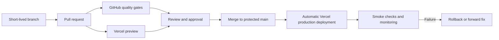

# Naqlia Master Project Blueprint

| Document field     | Value                                                                   |
| ------------------ | ----------------------------------------------------------------------- |
| Document status    | Baseline — authoritative project reference                              |
| Version            | 1.0                                                                     |
| Product            | Naqlia                                                                  |
| Product type       | Multi-tenant logistics software as a service (SaaS)                     |
| Primary market     | Kingdom of Saudi Arabia                                                 |
| Default language   | Arabic (`ar`, RTL)                                                      |
| Secondary language | English (`en`, LTR)                                                     |
| Owners             | Product and Engineering leadership                                      |
| Last updated       | 2026-08-02                                                              |
| Review cadence     | At least quarterly and before a material product or architecture change |

## Document Authority

This document is the single source of truth for Naqlia's product identity, direction, scope, and approved technical baseline. The [Naqlia Constitution](../.ai/constitution.md) is the higher authority for how product and engineering decisions, implementation, review, release, and operations are governed. This blueprint does not authorize implementation of a roadmap item by itself.

The terms **MUST**, **MUST NOT**, **SHOULD**, **SHOULD NOT**, and **MAY** indicate requirement strength. When another project document conflicts with this blueprint on product meaning or approved scope, this blueprint takes precedence unless the Constitution is the source of the governing rule. Detailed principles and guides may add implementation requirements but must remain consistent with both documents. Material architectural decisions must be recorded as Architecture Decision Records (ADRs) and reflected here when they alter the baseline.

## 1. Executive Summary

Naqlia is an Arabic-first, enterprise-grade logistics SaaS platform intended to help logistics organizations in Saudi Arabia coordinate transport operations through a secure, scalable, and maintainable digital system. The platform is expected to connect operational planning, shipment execution, fleet resources, tracking, documentation, communication, reporting, and integrations while preserving clear organizational and data boundaries.

Naqlia will begin as a feature-based modular monolith built with Next.js, React, TypeScript, Supabase, PostgreSQL, and Vercel. This architecture minimizes operational complexity during product discovery while creating explicit boundaries that can evolve as usage and organizational scale justify change.

The current repository contains the project foundation and documentation only. It intentionally contains no product page, authentication flow, API, business feature, or database schema. All functional scope in this blueprint is directional until a separately approved requirement authorizes implementation.

The platform's defining commitments are:

- Arabic-first user experience with complete RTL support and English parity.
- Strong multi-tenant isolation and least-privilege access.
- Clear feature ownership and stable contracts between modules.
- Automated quality, security, and deployment gates.
- Accessible, performant, observable, and SEO-capable delivery.
- Human-governed AI assistance with no compromise to privacy or engineering standards.

## 2. Vision

To become the trusted digital operating platform for modern logistics in Saudi Arabia, enabling organizations to move goods with greater clarity, control, reliability, and efficiency.

Naqlia should make complex transport operations understandable and actionable for Arabic-speaking teams while remaining interoperable with the broader logistics ecosystem.

## 3. Mission

Build a secure, Arabic-first logistics platform that unifies planning, execution, visibility, and operational insight; reduces fragmented manual work; improves service reliability; and gives logistics organizations a durable technology foundation for growth.

The mission will be pursued through incremental, measurable releases rather than a single broad launch. Each release must solve a validated operational problem and preserve the platform standards defined in this blueprint.

## 4. Business Goals

| Goal                            | Intended outcome                                                                                             | Evidence                                                                      |
| ------------------------------- | ------------------------------------------------------------------------------------------------------------ | ----------------------------------------------------------------------------- |
| Digitize logistics operations   | Replace fragmented spreadsheets, calls, and disconnected tools with traceable workflows.                     | Reduced manual handoffs, duplicate entry, and off-system work.                |
| Improve operational visibility  | Give authorized users timely status, ownership, and exception information.                                   | Increased tracking coverage and fewer unresolved status gaps.                 |
| Increase execution efficiency   | Reduce time spent planning, dispatching, reconciling, and reporting.                                         | Shorter cycle times and higher completed-work throughput.                     |
| Strengthen customer service     | Enable consistent, accurate communication about logistics activity.                                          | Faster response times and fewer status-related escalations.                   |
| Support organizational growth   | Let customers add users, locations, resources, and volume without redesigning their operating process.       | Stable service levels as customer usage grows.                                |
| Establish recurring SaaS value  | Create a product customers can adopt, retain, and expand across teams.                                       | Activation, retention, expansion, and renewal metrics.                        |
| Build a trusted Saudi product   | Deliver culturally appropriate Arabic UX and align with applicable Saudi legal and operational requirements. | Arabic adoption, customer trust indicators, and completed compliance reviews. |
| Enable an integration ecosystem | Connect with customer systems and approved external providers through governed contracts.                    | Reliable integrations and reduced duplicate data entry.                       |

Commercial targets, packaging, pricing, and forecast values remain product decisions and are listed in [Open Questions](#27-open-questions).

## 5. Target Market

### 5.1 Geographic focus

The initial market is the Kingdom of Saudi Arabia. Product decisions should reflect Saudi operating conditions, Arabic terminology, local time and currency conventions, mobile usage patterns, and applicable regulatory obligations. Regional expansion is a future decision and must not dilute Arabic-first delivery.

### 5.2 Primary customer segments

- Small and medium logistics companies seeking to replace manual or fragmented operations.
- Road freight carriers managing dispatch, drivers, vehicles, and shipment execution.
- Third-party logistics providers coordinating work across customers and subcontractors.
- Distribution and delivery operators that require shared operational visibility.

### 5.3 Secondary customer segments

- Shippers operating an internal transport function.
- Brokers or coordinators managing carrier networks.
- Enterprise logistics organizations requiring configurable workflows and integrations.
- Specialized logistics operators, subject to separate domain and compliance discovery.

### 5.4 Initial market exclusions

Air, maritime, customs brokerage, highly regulated dangerous-goods workflows, and global multi-jurisdiction operation are not assumed to be in the initial product scope. They require explicit discovery and approval before implementation.

## 6. User Types

User types describe expected responsibilities, not a finalized authorization model. Roles and permissions must be validated before authentication or database design begins.

| User type                  | Primary responsibilities                                                              | Typical access expectation                                                  |
| -------------------------- | ------------------------------------------------------------------------------------- | --------------------------------------------------------------------------- |
| Platform operator          | Operate the Naqlia service, support tenants, and manage platform-level configuration. | Restricted platform administration with audited, exceptional tenant access. |
| Organization owner         | Own the customer account, commercial relationship, and high-level configuration.      | Full organization administration, subject to separation-of-duties controls. |
| Organization administrator | Manage users, roles, locations, settings, and approved integrations.                  | Administrative access within one tenant.                                    |
| Operations manager         | Oversee workload, service levels, exceptions, and operational performance.            | Broad operational read/write access within authorized business units.       |
| Dispatcher or planner      | Plan, assign, sequence, and monitor transport work.                                   | Operational planning and assignment permissions.                            |
| Fleet manager              | Maintain vehicles, equipment, drivers, availability, and compliance records.          | Fleet and resource management permissions.                                  |
| Driver or field operator   | Receive assigned work, update execution status, and provide operational evidence.     | Mobile-focused access limited to assigned or permitted work.                |
| Customer service user      | Investigate status, communicate updates, and manage service exceptions.               | Read-oriented operational access with controlled communication actions.     |
| Finance user               | Review charges, invoices, reconciliation, and commercial reporting.                   | Financial permissions separated from operational administration.            |
| Compliance or audit user   | Review records, changes, evidence, and policy adherence.                              | Read-only or narrowly scoped review access with export controls.            |
| Analyst or executive       | Review dashboards, trends, and organizational performance.                            | Aggregated read access according to organizational scope.                   |
| Customer or shipper user   | Submit or review authorized requests and shipment information.                        | Portal access limited to the user's organization and permitted records.     |
| Integration identity       | Exchange data through approved system-to-system contracts.                            | Non-human, least-privilege credentials with rotation and auditability.      |

## 7. Core Services

In this section, **service** means a product capability or bounded platform responsibility. It does not imply a separately deployed microservice.

| Service area                        | Responsibility                                                                    | Initial disposition                                          |
| ----------------------------------- | --------------------------------------------------------------------------------- | ------------------------------------------------------------ |
| Tenant and organization management  | Organizational boundaries, locations, teams, settings, and tenancy context.       | Foundational requirement; design pending.                    |
| Identity and access management      | Authentication, roles, permissions, sessions, and access review.                  | Foundational requirement; design pending.                    |
| Party and network management        | Customers, carriers, subcontractors, contacts, and operating relationships.       | Candidate core domain.                                       |
| Fleet and resource management       | Drivers, vehicles, equipment, availability, and related records.                  | Candidate core domain.                                       |
| Order and shipment management       | Transport demand, shipment details, lifecycle, ownership, and references.         | Candidate core domain.                                       |
| Planning and dispatch               | Assignment, scheduling, sequencing, capacity decisions, and dispatch control.     | Candidate core domain.                                       |
| Trip execution and visibility       | Execution milestones, status, location inputs, exceptions, and ETA signals.       | Candidate core domain.                                       |
| Documents and proof                 | Attachments, transport documents, proof of pickup/delivery, and record retention. | Candidate core domain.                                       |
| Notifications and communication     | Event-driven, preference-aware operational communication.                         | Supporting platform capability.                              |
| Rating, billing, and reconciliation | Charges, rate inputs, invoice support, and financial reconciliation.              | Future scope pending commercial discovery.                   |
| Reporting and analytics             | Operational metrics, trends, exports, and decision support.                       | Incremental capability after trustworthy source data exists. |
| Integration management              | Governed inbound/outbound contracts, credentials, retries, and monitoring.        | Supporting platform capability.                              |
| Platform administration             | Feature configuration, support tooling, audit, and service operations.            | Restricted supporting capability.                            |

Each service area must have a named owner, defined data ownership, explicit public contracts, permission requirements, audit requirements, and measurable outcomes before implementation.

## 8. Functional Scope

### 8.1 Directional product scope

Naqlia is expected to support the following capability groups over time:

1. Organization onboarding and controlled workspace configuration.
2. User, team, role, and permission administration.
3. Customer, carrier, driver, vehicle, equipment, and location records.
4. Shipment or transport request intake with validation and references.
5. Planning, assignment, dispatch, and workload views.
6. Driver or field execution with status milestones and operational evidence.
7. Tracking and exception visibility for authorized stakeholders.
8. Document capture, retrieval, retention, and audit history.
9. Configurable notifications and communication records.
10. Search, filters, exports, dashboards, and operational reporting.
11. Governed integrations with customer and approved third-party systems.
12. Subscription, billing, and platform administration when commercial design is approved.

### 8.2 Foundation scope

The approved repository foundation includes architecture, tooling, documentation, internationalization boundaries, quality gates, and deployment automation. It excludes product behavior.

### 8.3 Explicitly out of scope without separate approval

- Business features, pages, APIs, server actions, database schemas, and migrations.
- Authentication, authorization, and tenant models.
- Live tracking, maps, telematics, or external carrier integrations.
- Payments, invoicing, tax calculation, or financial accounting.
- Automated decision-making or AI agents acting on operational records.
- Native mobile applications and offline synchronization.
- Regulatory claims or compliance certifications.

### 8.4 Scope governance

Every functional increment must begin with an approved problem statement, user outcome, acceptance criteria, data and permission boundaries, Arabic and English content, operational metrics, and explicit non-goals. A roadmap item is not implementation authorization.

## 9. Non-Functional Requirements

These are baseline engineering expectations. Product-specific Service Level Objectives (SLOs) must be refined with real usage and business criticality.

| Area                 | Baseline requirement                                                                                                                                   |
| -------------------- | ------------------------------------------------------------------------------------------------------------------------------------------------------ |
| Availability         | Production services should target at least 99.9% monthly availability after general availability, excluding approved maintenance.                      |
| Reliability          | Critical state changes must be idempotent where retries are possible and must not silently lose or duplicate work.                                     |
| Scalability          | Stateless application workloads must scale horizontally; data access must use indexed, tenant-aware patterns.                                          |
| Security             | Least privilege, secure defaults, tenant isolation, encrypted transport, secret separation, and auditable privileged actions are mandatory.            |
| Privacy              | Personal and commercially sensitive data must be minimized, purpose-limited, retained deliberately, and handled according to applicable obligations.   |
| Maintainability      | Strict types, modular ownership, small public surfaces, automated checks, and current documentation are required.                                      |
| Observability        | Production behavior must expose structured logs, metrics, traces where valuable, health signals, and actionable alerts without leaking sensitive data. |
| Recoverability       | Backup, restore, recovery point, and recovery time objectives must be approved and tested before critical production data is accepted.                 |
| Accessibility        | User-facing experiences must conform to WCAG 2.2 AA as defined in section 19.                                                                          |
| Internationalization | Arabic and English parity, RTL/LTR behavior, and locale-aware formatting are release requirements.                                                     |
| Portability          | External providers must be accessed behind owned contracts where practical; export and migration paths must be understood for critical data.           |
| Auditability         | Security-sensitive and material operational changes must be attributable, time-stamped, and reviewable.                                                |
| Compatibility        | Supported browser, device, and integration versions must be documented and tested before launch.                                                       |
| Testability          | Features must expose deterministic boundaries that support unit, integration, contract, and end-to-end testing proportional to risk.                   |

## 10. Technology Stack

The lockfile is authoritative for installed versions. Major upgrades require compatibility review, security review, validation, and an ADR when they change architectural behavior.

| Layer                    | Technology                     | Baseline use                                                                    |
| ------------------------ | ------------------------------ | ------------------------------------------------------------------------------- |
| Web framework            | Next.js 15 App Router          | Routing, rendering, metadata, server/client boundaries, and Vercel integration. |
| UI runtime               | React 19                       | Component composition and server/client rendering.                              |
| Language                 | TypeScript 5, strict mode      | Application, tooling, and contract types.                                       |
| Styling                  | Tailwind CSS 3                 | Token-aligned utility styling and responsive behavior.                          |
| Component foundation     | shadcn/ui and Radix primitives | Accessible, owned UI primitives rather than a closed component dependency.      |
| Internationalization     | `next-intl`                    | Locale routing, messages, pluralization, and formatting.                        |
| Data platform            | Supabase                       | Managed PostgreSQL access and approved platform services.                       |
| Database                 | PostgreSQL                     | Transactional source of truth when schema design is approved.                   |
| Hosting                  | Vercel                         | Preview and production delivery for the Next.js application.                    |
| Source control           | Git and GitHub                 | Version control, pull requests, reviews, actions, and dependency updates.       |
| Unit/integration testing | Vitest and Testing Library     | Fast behavior and component tests.                                              |
| Static quality           | ESLint, Prettier, TypeScript   | Linting, formatting, and compile-time validation.                               |
| Local Git gates          | Husky and lint-staged          | Fast checks on staged files before commit.                                      |
| Continuous integration   | GitHub Actions                 | Deterministic install, validation, audit, and production build.                 |
| Package management       | npm with committed lockfile    | Reproducible dependency installation through `npm ci`.                          |

Technology adoption principles:

- Prefer platform capabilities already in the approved stack.
- Add a dependency only when its value exceeds its security, bundle, maintenance, and migration cost.
- Pin direct dependencies and commit the lockfile.
- Use supported runtime versions and resolve security advisories promptly.
- Do not introduce a second tool for a solved concern without an approved migration plan.

## 11. Software Architecture Principles

1. **Feature-based modular monolith.** Organize product behavior by business capability. Begin with one deployable application and split services only when measured scaling, reliability, security, or team ownership requires it.
2. **Thin application routes.** `src/app` composes layouts, metadata, providers, and feature entry points. It must not become the home of domain logic or direct database queries.
3. **Explicit module contracts.** A feature exposes a narrow public surface. Other modules must not import its internal files.
4. **One-way dependency flow.** Application composition depends on feature contracts; features depend on shared platform abstractions; shared code never depends on product features.
5. **Server-first rendering.** Use React Server Components by default. Add client boundaries only for browser state or interaction and keep them as small as practical.
6. **Server-enforced trust boundaries.** Authentication, authorization, validation, tenant isolation, and privileged data access must be enforced outside the browser.
7. **Tenant context is explicit.** Every tenant-owned operation and data access path must carry and validate organization scope. Tenant separation must not rely on UI filtering.
8. **Data ownership is deliberate.** Each domain owns its records and invariants. Cross-domain writes require an explicit orchestration or event contract.
9. **External input is untrusted.** Validate input at system boundaries and convert it into typed internal representations.
10. **Idempotency and retries are designed.** Integrations and asynchronous work must define duplicate, ordering, timeout, and failure behavior.
11. **Observability is part of design.** Important workflows define signals, identifiers, safe diagnostics, and alerts before production release.
12. **Evolution is evidence-driven.** Prefer the simplest architecture that meets approved requirements. Record consequential trade-offs in ADRs and avoid speculative abstraction.
13. **Security and privacy by design.** Threat modeling, least privilege, data minimization, and safe defaults are design inputs, not release-stage additions.
14. **Internationalization by construction.** Locale, direction, messages, and formatting are part of every user-facing feature definition.
15. **Accessibility by construction.** Semantic structure, keyboard use, focus behavior, and assistive technology support are acceptance criteria.

See the [Architecture Guide](architecture-guide.md) for the current detailed dependency model.

## 12. Folder Organization

```text
naqlia/
├── .ai/                    # Constitution, governing principles, non-secret AI context, and reusable prompts
├── .github/                # Workflows and repository collaboration configuration
├── .husky/                 # Local Git hooks
├── docs/                   # Authoritative and supporting project documentation
├── public/                 # Static public assets
├── scripts/                # Reviewed engineering automation
├── src/
│   ├── app/[locale]/       # Locale-aware App Router composition
│   ├── assets/             # Imported fonts, icons, and images
│   ├── components/
│   │   ├── layouts/        # Reusable structural layouts
│   │   ├── shared/         # Domain-neutral composed components
│   │   └── ui/             # Design-system and shadcn/ui primitives
│   ├── config/             # Validated application configuration
│   ├── constants/          # Stable, domain-neutral constants
│   ├── features/           # Product capabilities and their private internals
│   ├── hooks/              # Cross-feature, domain-neutral hooks
│   ├── i18n/               # Locale routing and formatter configuration
│   ├── lib/supabase/       # Supabase clients and generated database types
│   ├── messages/ar/        # Arabic message catalogs
│   ├── messages/en/        # English message catalogs
│   ├── providers/          # Application-level React providers
│   ├── services/           # Shared external-system adapters
│   ├── styles/             # Tailwind entry point and global tokens
│   ├── types/              # Shared TypeScript contracts
│   └── utils/              # Small, pure, domain-neutral utilities
├── supabase/
│   ├── functions/          # Approved Supabase Edge Functions
│   └── migrations/         # Reviewed, forward PostgreSQL migrations
└── tests/
    ├── e2e/                # Critical cross-feature user journeys
    ├── fixtures/           # Deterministic test data
    ├── integration/        # Module and adapter integration tests
    ├── mocks/              # Shared test doubles
    └── unit/               # Pure unit and isolated component tests
```

Placement rules:

- Product-specific code belongs to the owning feature.
- Shared code must be demonstrably domain-neutral and have multiple legitimate consumers.
- Feature-specific tests, types, services, and UI should be co-located with their owner when that improves discoverability.
- Root test folders are reserved for cross-cutting suites and shared test support.
- Barrel files may define a module's public contract but must not hide circular dependencies.
- Empty directories should not accumulate speculative internal structures.
- Generated files must be clearly identified and must not be edited manually.

See the [Folder Structure Guide](folder-structure-guide.md) for placement examples.

## 13. Git Workflow

### 13.1 Branch strategy

- `main` is protected, releasable, and the source of production deployments.
- Work occurs on short-lived branches created from an up-to-date `main`.
- Recommended branch prefixes are `feat/`, `fix/`, `chore/`, `docs/`, `refactor/`, `test/`, and `ci/`.
- Long-lived environment branches and direct commits to `main` should be avoided.

### 13.2 Commit standard

Use Conventional Commits:

```text
<type>(optional-scope): concise imperative summary
```

Commits must be focused, reviewable, free of secrets, and understandable without relying on chat history. Generated changes must still have a responsible human or agent author and a clear rationale.

### 13.3 Pull requests

A pull request must include scope, outcome, validation evidence, risks, deployment impact, rollback considerations, and screenshots or recordings when UI behavior changes. Relevant product, architecture, security, data, Arabic/English, accessibility, and operational reviewers must be included.

Required checks include deterministic dependency installation, formatting, linting, strict type checking, tests, security audit, and production build. Branch protection rules should require passing checks and approvals before merge.

### 13.4 Merge and release history

Squash merge is the default for ordinary work. Preserve multiple commits only when their independent history adds operational or review value. Never rewrite shared protected history. Reverts and roll-forward fixes are preferred for production corrections.

See the [Git Workflow Guide](git-workflow.md) for contributor-level instructions.

## 14. Deployment Workflow

### 14.1 Environments

| Environment | Source                                    | Purpose                                                 | Data rule                                                      |
| ----------- | ----------------------------------------- | ------------------------------------------------------- | -------------------------------------------------------------- |
| Local       | Developer branch and `.env.local`         | Development and isolated verification.                  | No production credentials or customer data.                    |
| Preview     | Pull request or non-production Git branch | Review, integration checks, and stakeholder acceptance. | Isolated non-production services and sanitized data.           |
| Production  | Protected `main` revision                 | Customer-facing service.                                | Production-only encrypted configuration and controlled access. |

### 14.2 Delivery sequence



### 14.3 Deployment requirements

- Deployments must reference immutable Git commits.
- Environment variables must be separated by environment and maintained outside Git.
- Database migrations, when introduced, require compatibility, backup, rollout, and recovery planning.
- Production release verification must confirm the revision, build status, domain, critical routes, locale behavior, error signals, and relevant integrations.
- Rollback must promote a known-good deployment or revert the responsible change; database state requires a separate recovery strategy.
- Preview and production configuration should be equivalent except for environment-specific values and explicitly documented controls.

See the [Deployment Guide](deployment-guide.md) for operational setup.

## 15. AI Development Workflow

AI tools may assist with discovery, implementation, testing, documentation, and review. They do not approve scope, own business decisions, or reduce engineering standards.

### 15.1 Required workflow

1. Read the user request, this blueprint, applicable guides, owning feature contract, and nearby tests.
2. Confirm the intended outcome, non-goals, affected data, permission boundary, locale impact, and validation plan.
3. Inspect the repository before proposing or editing files; do not invent existing contracts.
4. Make the smallest coherent change within the approved scope.
5. Add or update Arabic and English content, tests, documentation, and observability where applicable.
6. Run the required validation and production build.
7. Review the resulting diff for secrets, unrelated edits, boundary violations, accessibility, security, and deployment risk.
8. Provide a handoff containing changes, evidence, assumptions, risks, and any manual follow-up.

### 15.2 AI guardrails

- AI must not create business features from roadmap text without an explicit implementation request.
- Customer data, credentials, private logs, and sensitive operational records must not be placed in prompts or committed context.
- AI-generated code is reviewed and tested to the same standard as human-written code.
- AI must not fabricate requirements, APIs, database contracts, compliance claims, test results, or deployment status.
- AI must preserve unrelated work and ask for direction when a decision materially changes product scope or external state.
- High-impact generated changes require human review by the accountable domain owner.
- Reusable prompts and stable non-secret context may be versioned under `.ai/`; transient conversations are not project specifications.

### 15.3 Prompt quality standard

A production prompt should state the outcome, approved scope, non-goals, relevant files, architectural owner, acceptance criteria, Arabic/English and RTL/LTR expectations, security and privacy constraints, tests, validation commands, and prohibited changes.

See the [AI Development Guide](ai-development-guide.md) for the working convention.

## 16. Coding Standards

### 16.1 TypeScript

- Strict mode must remain enabled.
- `any` must not be introduced; use `unknown` and narrow at trust boundaries.
- External data must be runtime-validated before entering domain code.
- Prefer explicit domain types and discriminated unions over unchecked casts.
- Public functions and module contracts should make errors and side effects understandable.
- Path aliases should replace long or fragile relative imports.

### 16.2 React and Next.js

- Use Server Components by default.
- Add `"use client"` only at the smallest interactive boundary.
- Route files compose features and must remain free of domain rules and direct data access.
- Components should have one clear responsibility and use composition over large mode-driven APIs.
- Loading, empty, error, unauthorized, and success states are first-class product states.

### 16.3 Naming and organization

- Use `kebab-case` for folders and non-component files.
- Use `PascalCase` for React component symbols and `camelCase` for functions and variables.
- Prefix hooks with `use`.
- Name tests `*.test.ts` or `*.test.tsx`.
- Keep exports deliberate and remove obsolete code rather than preserving unused compatibility layers.

### 16.4 Errors, logs, and comments

- Return safe user-facing errors and retain structured, non-sensitive diagnostic context.
- Never log secrets, access tokens, personal data, or commercially sensitive payloads.
- Comments explain intent, invariants, or non-obvious trade-offs; they do not restate the code.
- Temporary workarounds require an owner, reason, and removal condition.

### 16.5 Testing and dependencies

- Test behavior and contracts, not framework internals.
- Match test depth to risk: unit, integration, contract, end-to-end, accessibility, and performance as appropriate.
- A dependency requires a clear owner, purpose, license and security review, and bundle/operational impact assessment.
- Formatting, lint, type, test, audit, and build checks must not be bypassed for merge.

See the [Coding Standards Guide](coding-standards.md) for concise contributor rules.

## 17. Security Principles

1. **Secure by default.** New functionality starts inaccessible until an explicit policy grants access.
2. **Least privilege.** Human and machine identities receive only the permissions required for their current responsibility.
3. **Defense in depth.** UI restrictions never replace server authorization, database policy, validation, rate limits, or monitoring.
4. **Tenant isolation.** Tenant-owned data is scoped and enforced on every access path. PostgreSQL Row Level Security must be evaluated as a core control, not the sole control.
5. **Secret separation.** Secrets remain in approved encrypted stores. Privileged Supabase keys are server-only and must never use a `NEXT_PUBLIC_` prefix.
6. **Data minimization.** Collect, expose, retain, and export only data required for an approved purpose.
7. **Safe data lifecycle.** Classification, retention, deletion, backup, restore, and export rules must be defined before sensitive production data is accepted.
8. **Encrypted transport and storage.** Use modern TLS in transit and provider-supported encryption at rest; exceptions require documented review.
9. **Validated boundaries.** Treat browser input, files, webhooks, integration payloads, and AI output as untrusted.
10. **Audited privilege.** Administrative access and material security or operational changes must be attributable and reviewable.
11. **Supply-chain hygiene.** Lock dependencies, review updates, scan for vulnerabilities, minimize packages, and protect CI/CD permissions.
12. **Environment isolation.** Development and preview environments must not provide a path to production data or credentials.
13. **Resilient recovery.** Backups and restoration must be tested; incident response and notification responsibilities must be documented.
14. **Responsible disclosure.** Security concerns require a private reporting channel and a defined triage process.

Before each material feature, perform lightweight threat modeling covering assets, actors, trust boundaries, abuse cases, controls, residual risks, and monitoring. Legal and regulatory interpretation must be reviewed by qualified stakeholders; this blueprint is not legal advice.

## 18. SEO Principles

SEO applies to approved public content. Authenticated operational screens must not be indexed.

- Public routes use stable, descriptive, locale-aware URLs.
- Each indexable page defines unique localized title, description, canonical URL, and social metadata.
- Arabic and English equivalents use correct `hreflang` relationships, including an approved default strategy.
- Sitemaps contain canonical, indexable URLs only and are updated with content lifecycle changes.
- `robots.txt`, metadata robots directives, and authentication controls prevent indexing of private or duplicate content.
- Semantic heading order, landmarks, link text, and structured data must reflect visible content accurately.
- Structured data may be used only when it matches the page and applicable search-engine rules.
- Redirects preserve intent and avoid chains; deleted public content returns an appropriate status.
- Performance and accessibility are SEO requirements, not separate optimizations.
- Server-rendered content should remain understandable without client-side execution where practical.
- SEO monitoring should track indexing, crawl issues, Core Web Vitals, localized discovery, and broken links.

No public marketing information architecture is approved by this blueprint.

## 19. Accessibility Standards

Naqlia user experiences must target WCAG 2.2 Level AA.

Minimum standards include:

- Semantic HTML and correctly named landmarks, headings, controls, and form fields.
- Complete keyboard operation with visible, predictable focus and no keyboard traps.
- Sufficient text and non-text contrast in every state, including disabled, error, focus, and selected states.
- Text resizing and responsive reflow without loss of content or functionality.
- Accessible names and descriptions for icons, inputs, data visualizations, and custom controls.
- Error identification that explains the problem and recovery in text, not color alone.
- Status and validation changes announced appropriately to assistive technologies.
- Reduced-motion support and no interaction that depends solely on animation, hover, drag, or precise pointer input.
- Logical reading and focus order in both RTL and LTR layouts.
- Arabic and English language metadata for correct pronunciation and reading behavior.
- Accessible tables, charts, exports, maps, and document workflows when introduced.
- Manual keyboard and screen-reader review for critical journeys in addition to automated checks.

Accessibility defects that block a critical workflow are release blockers.

## 20. Performance Targets

Targets apply at the 75th percentile unless a stricter product SLO is approved. They must be measured on representative mobile and desktop conditions, not only developer hardware.

| Measure                         | Initial target                                                                                             |
| ------------------------------- | ---------------------------------------------------------------------------------------------------------- |
| Largest Contentful Paint (LCP)  | At or below 2.5 seconds for key public and operational entry views.                                        |
| Interaction to Next Paint (INP) | At or below 200 milliseconds.                                                                              |
| Cumulative Layout Shift (CLS)   | At or below 0.1.                                                                                           |
| Cached public-page TTFB         | At or below 800 milliseconds.                                                                              |
| Core server read operation      | p95 at or below 500 milliseconds, excluding documented external-provider latency.                          |
| Core server write operation     | p95 at or below 1 second for ordinary transactional operations.                                            |
| Initial client JavaScript       | Target at or below 200 KB compressed per ordinary entry route; exceptions require review.                  |
| Production error rate           | Below the approved SLO error budget; critical workflows require explicit alerts.                           |
| Lighthouse quality              | Target 90 or higher for Performance, Accessibility, Best Practices, and SEO on applicable reference pages. |

Performance engineering rules:

- Establish a baseline before optimization and monitor real-user measurements after launch.
- Set budgets for JavaScript, images, fonts, queries, and third-party scripts.
- Avoid unnecessary client rendering, waterfalls, polling, and unbounded data retrieval.
- Paginate or virtualize large operational datasets and maintain stable interaction feedback.
- Index database access according to measured query patterns and inspect query plans for critical paths.
- Cache only with an explicit freshness, tenant, privacy, and invalidation strategy.
- Load integrations and analytics without blocking critical user work where practical.

## 21. Internationalization Strategy

### 21.1 Locale model

- Arabic (`ar`) is the default product locale and uses RTL direction.
- English (`en`) is the secondary locale and uses LTR direction.
- Route locales remain short identifiers; formatting may use Saudi regional conventions such as `ar-SA` and `en-SA` where approved.
- Locale must be represented in public and application routing through `src/app/[locale]`.

### 21.2 Content and formatting

- User-facing product copy must live in versioned locale message catalogs.
- Every released message key must have reviewed Arabic and English values.
- Dates, times, numbers, percentages, currencies, units, lists, and plurals use locale-aware formatters.
- Store instants in UTC and display them in an explicit user or organization timezone; the initial business default is expected to be `Asia/Riyadh` pending product confirmation.
- Saudi riyal presentation, calendar expectations, numeral preferences, and logistics terminology require product and localization review.
- Do not concatenate translated fragments or assume English word order.

### 21.3 Bidirectional design

- Set `lang` and `dir` at the document boundary from the active locale.
- Prefer CSS logical properties and direction-aware layout primitives.
- Icons representing direction or sequence must be reviewed; brand marks, media controls, numbers, maps, and other invariant visuals must not be mirrored blindly.
- Mixed Arabic, English, codes, phone numbers, vehicle identifiers, and addresses must be tested for bidirectional isolation and readability.
- Layouts must tolerate translated text expansion without clipping or loss of function.

### 21.4 Localization operations

Message ownership, translation review, terminology, fallback behavior, missing-key detection, release synchronization, and localized QA must be defined before the first product feature ships. Machine translation may assist drafts but cannot replace approved review for critical operational language.

## 22. Future Roadmap

The roadmap is directional and gated. It does not authorize implementation.

### Phase 0 — Foundation and governance

- Repository, tooling, architecture boundaries, CI/CD, documentation, and AI guardrails.
- Product discovery, user research, terminology, initial design principles, and decision ownership.
- Exit gate: approved master blueprint and prioritized discovery questions.

### Phase 1 — Product and platform design

- Validate target segment, core journeys, tenant model, roles, permissions, and commercial model.
- Define domain language, information architecture, design tokens, accessibility patterns, and localization operations.
- Design data ownership, audit, threat model, privacy model, observability, and recovery objectives.
- Exit gate: reviewed requirements, architecture decisions, security model, and measurable MVP scope.

### Phase 2 — Platform essentials

- Implement approved organization, identity, access, configuration, audit, and operational support foundations.
- Establish production observability, incident response, data lifecycle, backup, and restore procedures.
- Exit gate: security and operational readiness for limited customer data.

### Phase 3 — Operational MVP

- Implement the smallest validated shipment, planning, dispatch, execution, visibility, document, and exception workflows.
- Pilot with a narrow customer group and measure activation, task success, reliability, and Arabic usability.
- Exit gate: validated product value and stable critical journeys.

### Phase 4 — Commercialization and ecosystem

- Expand integrations, customer self-service, reporting, subscription controls, and approved financial workflows.
- Formalize onboarding, support, release communication, and service management.
- Exit gate: repeatable onboarding, retention evidence, and supportable unit economics.

### Phase 5 — Enterprise scale and intelligence

- Add advanced configuration, analytics, automation, partner ecosystem capabilities, and evidence-based AI assistance.
- Reassess service decomposition, regional expansion, data architecture, and enterprise compliance based on measured needs.
- Exit gate: approved scale strategy with demonstrated customer demand.

## 23. Risks

| Risk                            | Potential impact                                                                               | Primary response                                                                              |
| ------------------------------- | ---------------------------------------------------------------------------------------------- | --------------------------------------------------------------------------------------------- |
| Unvalidated breadth             | A broad logistics scope delays value and creates inconsistent workflows.                       | Select a primary segment and narrow MVP journey before implementation.                        |
| Tenant data exposure            | Cross-organization access could cause severe legal, commercial, and trust harm.                | Explicit tenant context, server authorization, database controls, tests, and audit.           |
| Authorization complexity        | Informal roles may produce excessive access or block real operations.                          | Role and permission discovery, policy modeling, least privilege, and access reviews.          |
| Regulatory uncertainty          | Incorrect assumptions may require redesign or create compliance exposure.                      | Qualified legal/compliance review and documented data/process decisions.                      |
| Arabic quality gaps             | Literal translation or weak RTL behavior may reduce adoption and safety.                       | Arabic-first design, terminology ownership, native review, and bidirectional QA.              |
| Integration variability         | External systems may be incomplete, unstable, or inconsistent.                                 | Versioned contracts, adapters, idempotency, retries, reconciliation, and monitoring.          |
| Poor source data                | Inaccurate customer, vehicle, driver, or shipment data weakens automation and reporting.       | Validation, ownership, data quality metrics, and correction workflows.                        |
| Mobile connectivity constraints | Field users may lose work or visibility in unreliable networks.                                | Research connectivity patterns and decide offline/retry scope before driver workflows.        |
| Vendor concentration            | Heavy provider coupling may increase cost or reduce recovery options.                          | Owned abstractions for critical contracts, exports, backups, and reviewed exit plans.         |
| Premature complexity            | Microservices or generic frameworks may slow delivery without proven benefit.                  | Modular monolith, measurable thresholds, and ADR-based evolution.                             |
| Performance degradation         | Large operational datasets and live updates may make critical views unusable.                  | Budgets, pagination, indexing, realistic load tests, and real-user monitoring.                |
| Security supply-chain events    | Vulnerable dependencies or CI compromise may affect production.                                | Minimal dependencies, lockfiles, automated scanning, protected workflows, and rapid patching. |
| Insufficient observability      | Failures may be detected by customers before the team can diagnose them.                       | Define workflow signals, alerts, ownership, and runbooks before release.                      |
| AI misuse                       | Sensitive data leakage or unreviewed generated behavior could create defects and trust issues. | AI guardrails, data restrictions, human review, provenance, and validation.                   |
| Adoption and change management  | Teams may retain off-system processes even when software is available.                         | User research, assisted onboarding, simple workflows, training, and adoption metrics.         |

Risks must have an accountable owner, review cadence, current rating, mitigation actions, and escalation path before the relevant phase begins.

## 24. Success Metrics

Business and product targets require baselines during discovery. Metrics must be segmented by tenant and role without exposing one tenant's information to another.

### 24.1 Business outcomes

- Qualified organization activation and time to first operational value.
- Active organizations, retained organizations, renewal, expansion, and churn.
- Onboarding duration, implementation effort, and support cost per organization.
- Conversion from pilot to paid use and adoption across customer teams.

### 24.2 User and operational outcomes

- Completion rate and median time for critical workflows.
- Reduction in manual handoffs, duplicate entry, and off-platform status requests.
- Percentage of operational work with current, trusted status information.
- Exception detection, acknowledgement, and resolution time.
- Data completeness and correction rates for required operational records.
- Arabic and English adoption, task success, and satisfaction by user type.
- Customer-reported reliability, visibility, and service-quality improvement.

### 24.3 Platform health

- Availability, latency, error rate, and SLO compliance for critical journeys.
- Core Web Vitals and performance-budget compliance.
- Security vulnerability age, privileged access review, and incident metrics.
- Backup completion, restoration test success, recovery time, and recovery point performance.
- Integration success, retry, duplicate, reconciliation, and freshness rates.

### 24.4 Engineering delivery

- Lead time from approved change to production.
- Deployment frequency, change failure rate, rollback rate, and mean time to recovery.
- CI success rate, flaky-test rate, escaped defect rate, and critical-path test coverage.
- Dependency freshness and time to remediate high-severity vulnerabilities.
- Architecture exceptions, unresolved ADR actions, and documentation freshness.

Metrics must drive decisions rather than vanity reporting. Each production metric requires a definition, owner, source, expected range, and response when it deteriorates.

## 25. Definition of Done

A change is done only when every applicable item below is satisfied.

### Product and scope

- The approved problem, user outcome, acceptance criteria, and non-goals are met.
- No unrelated behavior or speculative capability was added.
- Product, UX, data, and operational owners accepted the result where required.

### Architecture and implementation

- Code resides in the correct owning module and respects dependency direction.
- Public contracts, trust boundaries, tenant scope, and failure behavior are explicit.
- No avoidable duplication, dead code, unchecked cast, or unowned dependency remains.
- Material decisions and trade-offs are documented.

### Security and data

- Authentication, authorization, validation, privacy, audit, rate, and abuse cases were reviewed as applicable.
- Secrets and sensitive data are absent from source, logs, fixtures, screenshots, and prompts.
- Database and integration changes include migration, compatibility, idempotency, and recovery considerations.
- No unresolved critical or high-severity vulnerability is introduced without formally accepted risk.

### Experience quality

- Arabic and English content is complete and reviewed.
- RTL and LTR layout, mixed-direction content, and locale formatting were verified.
- WCAG 2.2 AA requirements and keyboard/focus behavior were tested.
- Loading, empty, success, validation, error, permission, and recovery states are handled.
- Applicable SEO metadata, canonicalization, indexing, and structured data are correct.
- Performance budgets and representative-device behavior meet the approved target.

### Verification

- Proportionate unit, integration, contract, end-to-end, accessibility, security, and performance tests pass.
- `npm run validate` passes.
- `npm run build` passes.
- The resulting diff is reviewed for unintended files and changes.

### Delivery and operations

- Documentation, environment examples, runbooks, dashboards, and alerts are current.
- CI is green and the preview deployment is accepted where applicable.
- Deployment, data migration, feature control, monitoring, and rollback steps are understood.
- Production deployment is verified against the intended immutable commit.
- Known limitations, residual risks, and follow-up ownership are recorded.

Documentation-only changes apply the relevant scope, accuracy, formatting, review, Git, CI, and deployment requirements; they do not require artificial application code or tests.

## 26. Glossary

| Term                 | Definition                                                                                              |
| -------------------- | ------------------------------------------------------------------------------------------------------- |
| ADR                  | Architecture Decision Record documenting a material technical decision, alternatives, and consequences. |
| Carrier              | An organization responsible for transporting goods.                                                     |
| Client Component     | A React component that executes in the browser and is explicitly marked with `"use client"`.            |
| Core Web Vitals      | User-experience measures including LCP, INP, and CLS.                                                   |
| Dispatcher           | A user who assigns and coordinates transport work.                                                      |
| ETA                  | Estimated time of arrival.                                                                              |
| Feature              | A cohesive product capability with owned UI, behavior, data access, types, and tests.                   |
| Integration identity | A non-human identity used for approved system-to-system access.                                         |
| LTR                  | Left-to-right content and layout direction.                                                             |
| Modular monolith     | One deployable application with explicit internal capability boundaries.                                |
| Naqlia               | The logistics SaaS platform governed by this blueprint.                                                 |
| Organization         | A customer or operating entity using Naqlia; the exact tenancy relationship is pending design.          |
| Preview deployment   | A non-production Vercel deployment associated with a branch or pull request.                            |
| Proof of delivery    | Evidence that a delivery event occurred, subject to approved workflow requirements.                     |
| RLS                  | PostgreSQL Row Level Security, used to enforce data-access policies at the database layer.              |
| RPO                  | Recovery Point Objective: the maximum acceptable data-loss window after disruption.                     |
| RSC                  | React Server Component, rendered on the server without shipping its component logic to the browser.     |
| RTO                  | Recovery Time Objective: the target duration to restore service after disruption.                       |
| RTL                  | Right-to-left content and layout direction used by Arabic.                                              |
| SaaS                 | Software delivered as an operated, subscription-oriented service.                                       |
| Shipment             | A unit of transport demand and its lifecycle; the exact domain definition is pending discovery.         |
| Shipper              | The party requesting or originating transport of goods.                                                 |
| SLI                  | Service Level Indicator: a measured signal used to assess service behavior.                             |
| SLO                  | Service Level Objective: a target value or range for an SLI.                                            |
| Tenant               | An isolated customer data and access boundary in a multi-tenant platform.                               |
| Trip                 | An execution grouping involving transport work and resources; the exact model is pending discovery.     |
| Workspace            | A user-facing organizational context; whether it maps one-to-one with a tenant is an open decision.     |

## 27. Open Questions

These questions must be resolved by the accountable stakeholders before the dependent implementation begins.

| Area              | Open question                                                                                                                 | Decision owner                                 |
| ----------------- | ----------------------------------------------------------------------------------------------------------------------------- | ---------------------------------------------- |
| Market            | Which customer segment and transport mode define the first commercial product?                                                | Product and commercial leadership              |
| Value proposition | Which measurable operational problem must the MVP solve better than current alternatives?                                     | Product leadership                             |
| Commercial model  | What are the packaging, pricing unit, trial, contract, and billing expectations?                                              | Commercial and finance leadership              |
| Tenancy           | What is the relationship among tenant, organization, workspace, branch, and business unit?                                    | Product, architecture, and security            |
| Roles             | Which roles, permissions, delegations, and separation-of-duties rules are required?                                           | Product, security, and customer operations     |
| Domain model      | How are order, shipment, load, stop, route, trip, task, and delivery defined and related?                                     | Domain product owner and architecture          |
| Network model     | How do shippers, carriers, subcontractors, brokers, and customers collaborate across tenant boundaries?                       | Product, legal, and security                   |
| Fleet scope       | Which vehicle, equipment, driver, availability, and compliance records belong in the first release?                           | Operations product owner                       |
| Tracking          | Which location sources, update frequency, consent rules, and fallback methods are acceptable?                                 | Product, security, privacy, and operations     |
| Documents         | Which documents and evidence are required, who may access them, and how long are they retained?                               | Operations, legal, and compliance              |
| Integrations      | Which customer systems and external providers are first priority, and what contract standards apply?                          | Product and integration architecture           |
| Notifications     | Which channels, events, languages, consent rules, quiet hours, and escalation policies are required?                          | Product, legal, and customer operations        |
| Offline behavior  | Do field workflows require offline capture, background synchronization, or delayed status submission?                         | Product and mobile architecture                |
| Localization      | Who owns Arabic terminology, translation approval, numerals, calendar behavior, and fallback policy?                          | Product and localization owner                 |
| Time and units    | Which timezone, calendar, currency display, measurement units, and address conventions are configurable?                      | Product and localization owner                 |
| Privacy           | What data classifications, lawful purposes, residency constraints, retention periods, and deletion workflows apply?           | Legal, privacy, and security                   |
| Compliance        | Which transport, cybersecurity, accessibility, contractual, and certification obligations apply to the target segment?        | Legal, compliance, and security                |
| Availability      | Which workflows are business-critical and what SLO, RPO, RTO, support, and maintenance commitments apply?                     | Product, operations, and engineering           |
| Support           | What are the service desk, tenant administration, incident communication, and privileged support-access models?               | Customer success, operations, and security     |
| Analytics         | Which operational metrics are trustworthy, actionable, and permitted for cross-customer benchmarking?                         | Product, data, privacy, and commercial         |
| AI                | Which assistive AI use cases provide validated value, and what data, approval, explainability, and human-control rules apply? | Product, security, privacy, and legal          |
| Mobile delivery   | Is responsive web sufficient, or is a native application required for specific users or device capabilities?                  | Product and engineering                        |
| Regional growth   | Which capabilities must remain Saudi-specific and which should be configurable for future markets?                            | Product and architecture                       |
| Ownership         | Who is accountable for each core service, SLO, data set, runbook, and roadmap gate?                                           | Executive, product, and engineering leadership |

Open questions should move into dated decisions, requirements, or ADRs as they are resolved. This table must be reviewed whenever scope or roadmap priorities change.
