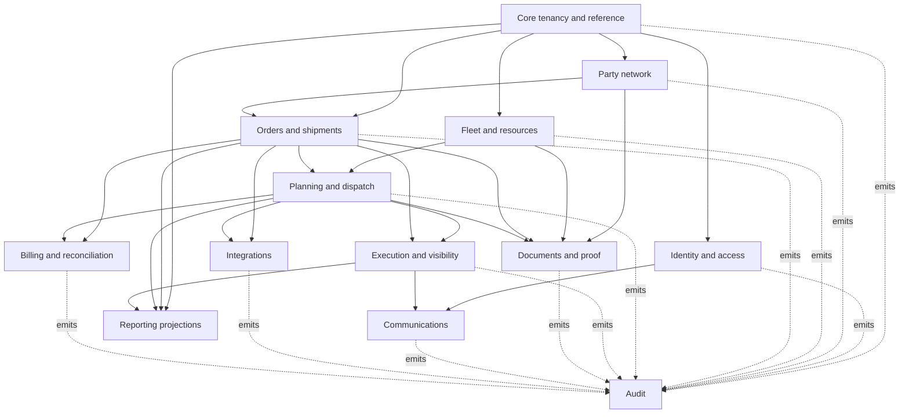

# Naqlia Database Architecture

| Document field    | Value                                                                                                                                                                                                    |
| ----------------- | -------------------------------------------------------------------------------------------------------------------------------------------------------------------------------------------------------- |
| Status            | Approved conceptual architecture; not implemented                                                                                                                                                        |
| Version           | 1.0                                                                                                                                                                                                      |
| Parent document   | [Naqlia Master Project Blueprint](00-Project-Blueprint.md)                                                                                                                                               |
| Related documents | [Domain Model Suite](domain/01-Domain-Model.md), [Conceptual ERD](02-ERD.md), [Naming Conventions](03-Naming-Conventions.md), [RLS Strategy](04-RLS-Strategy.md), [Audit Strategy](05-Audit-Strategy.md) |
| Owners            | Data Architecture, Engineering, Security, and Product                                                                                                                                                    |
| Last updated      | 2026-08-03                                                                                                                                                                                               |

## 1. Purpose and Scope

This document defines the complete conceptual database architecture for Naqlia. It establishes domain ownership, entity boundaries, relationship rules, tenancy, data lifecycle, consistency, and scalability decisions so a database engineer can later create an implementation plan without redefining the architecture.

The approved [Domain Model Suite v1](domain/01-Domain-Model.md) is the definitive logical business model for PDS v1. It supplies the implementation entity inventory, fields, relationships, lifecycle, deletion policy, and events. The broader pre-PDS entities in this architecture and the Conceptual ERD remain future context only when the Domain Model Suite marks them `FUTURE` or omits them.

This is documentation only. It contains no SQL, physical database objects, migrations, Supabase configuration, APIs, or product implementation. Entity names describe future relational structures; their presence here does not authorize implementation.

## 2. Architectural Decisions

The following decisions are normative.

1. **PostgreSQL is the transactional source of truth.** Supabase provides the managed PostgreSQL platform, authentication boundary, storage metadata, and related services when implementation is authorized.
2. **Naqlia starts as one logical database.** Domain schemas and ownership rules create modular boundaries inside one transactional database. Database-per-tenant and microservice databases are deferred until measured scale, isolation, or regulatory requirements justify them.
3. **An organization is the tenant boundary.** Every tenant-owned entity stores an immutable `organization_id`. A user may be a member of multiple organizations.
4. **Business units are optional scopes inside a tenant.** They support branches, divisions, or operational regions without becoming independent security tenants.
5. **Supabase Auth identity is external to the application model.** An application profile maps uniquely to the primary key of the managed Auth user. Application domains never depend directly on mutable Auth metadata.
6. **Authorization is membership-based RBAC with contextual constraints.** Organization roles grant permission keys; business-unit scope, assignment, ownership, record state, and explicit sharing add attribute-based constraints.
7. **Row Level Security is mandatory defense in depth.** RLS is enabled on every client-reachable entity. Server authorization remains mandatory and cannot be replaced by RLS.
8. **Application-owned primary keys use UUID version 7.** IDs are globally unique and time-ordered for index locality. Creation timestamps remain authoritative for business ordering.
9. **Operational history and audit history are different.** Domain events describe logistics state transitions; audit events describe who or what changed or accessed governed data.
10. **Mutable roots keep current state; material transitions are append-only.** Shipment, trip, and exception roots expose current state for efficient work, while dedicated event entities preserve business history.
11. **Cross-domain writes are owned.** A domain may read another domain's public contract but may not directly mutate its internal entities. Multi-domain workflows use an explicit orchestration boundary and transactional outbox.
12. **No implicit cross-tenant sharing exists.** Collaboration between organizations requires an explicit, revocable connection and resource grant.
13. **Deletion is policy-driven.** Soft deletion is used only for suitable mutable records. Financial, audit, status, integration, and other ledger-like facts are reversed, superseded, redacted, or archived rather than rewritten.
14. **The database stores instants in UTC.** User and organization timezones affect presentation and planning interpretation, not storage precision.
15. **Analytics cannot compromise the transaction model.** Operational reporting may use projections; large-scale analytics moves to a separate read platform through governed change capture when justified.

## 3. Tenancy Model

### 3.1 Tenant definition

`organization` is the hard security and ownership boundary. One organization represents one subscribed customer account, even when that customer contains multiple branches or operating divisions.

Every tenant-owned entity must:

- contain a non-null, immutable `organization_id`;
- reference only records belonging to the same organization unless an approved sharing contract says otherwise;
- include `organization_id` in access paths, uniqueness rules, and tenant-sensitive indexes;
- prevent re-parenting to another organization through ordinary update operations;
- participate in RLS and server authorization checks;
- carry the organization context into audit and integration events.

### 3.2 Internal organization structure

`business_unit` represents a branch, division, region, depot, or other hierarchical operating scope inside an organization. It is adjacency-based: a business unit may have one parent in the same organization and may have many children. Cycles are forbidden.

Business-unit scoping is optional at the entity level. A null business-unit reference means organization-wide, not public. Authorization may grant a membership access to the whole organization or to one or more business-unit subtrees.

### 3.3 Multiple organization memberships

A profile may have multiple active organization memberships, but every request operates in one explicit active organization context. The client-selected organization is only a routing hint; authorization proves membership and scope from trusted database state.

### 3.4 Future cross-organization collaboration

Two tenants remain isolated even when they represent commercial partners. Future collaboration uses:

- an approved `organization_connection` between two organizations;
- direction, purpose, status, validity, and approver metadata;
- granular `resource_share` grants for specific records or data products;
- explicit receiving and revocation behavior;
- audit events on creation, use, change, and revocation.

Shared access never changes the owning organization of a record and never makes tenant data globally discoverable.

## 4. Logical Schema Boundaries

Schema names are logical ownership boundaries, not deployment units.

| Schema           | Ownership and responsibility                                                                       | Client exposure posture                                            |
| ---------------- | -------------------------------------------------------------------------------------------------- | ------------------------------------------------------------------ |
| `auth`           | Supabase-managed identities, sessions, and authentication audit records.                           | Managed by Supabase; never application-owned.                      |
| `storage`        | Supabase-managed object and bucket metadata.                                                       | Managed by Supabase; application access requires storage policies. |
| `core`           | Organizations, business units, locations, shared reference data, and tenant connections.           | Deny by default; expose selected entities only with RLS.           |
| `identity`       | Profiles, memberships, roles, permissions, access scopes, service principals, and platform grants. | Restricted; no anonymous access.                                   |
| `network`        | Tenant-owned parties, contacts, addresses, party roles, and commercial relationships.              | Tenant-scoped with RLS.                                            |
| `fleet`          | Drivers, vehicles, equipment, availability, maintenance, and resource assignments.                 | Tenant-scoped with RLS.                                            |
| `transport`      | Transport orders, shipments, items, stops, references, and shipment status history.                | Tenant-scoped with RLS.                                            |
| `dispatch`       | Trips, trip stops, shipment legs, resource assignments, and dispatch history.                      | Tenant-scoped with RLS.                                            |
| `tracking`       | Tracking sessions, position observations, ETA estimates, milestones, and operational exceptions.   | Narrow tenant/assignment access; high-volume controls.             |
| `documents`      | Document metadata, versions, domain-specific associations, and delivery proof.                     | Tenant-scoped; storage access must mirror metadata authorization.  |
| `communications` | Notification preferences, requests, deliveries, templates, and delivery attempts.                  | Service-write; narrowly exposed user preferences.                  |
| `integrations`   | Connections, mappings, inbound/outbound messages, webhooks, idempotency, and outbox events.        | Service-only by default.                                           |
| `billing`        | Future subscriptions, rate agreements, charges, invoices, and usage records.                       | Finance/service-only by default.                                   |
| `audit`          | Immutable application audit events, event details, retention classes, and legal holds.             | Not directly client writable; restricted read access.              |
| `reporting`      | Governed operational projections, exports, and future analytical read models.                      | Read-only and tenant-scoped.                                       |
| `platform`       | Feature entitlements, controlled configuration, job runs, and platform operations.                 | Platform service and privileged staff only.                        |
| `private`        | Authorization helpers and trusted database internals.                                              | Never exposed through the Data API.                                |

The default `public` schema should contain no business entities. If compatibility requires public objects later, they must be intentionally reviewed, granted, and protected; default exposure is not authorization.

## 5. Domain Dependency Model

Rules:

- The arrows indicate allowed dependency on a public contract, not unrestricted joins or writes.
- `audit` observes changes; business logic must not depend on audit records to reconstruct current state.
- `reporting` consumes governed projections and must not become the write path for operational data.
- `integrations` translates external contracts and invokes owning domain commands; it never writes domain internals directly.
- Cyclic domain dependencies require redesign or an explicit orchestration contract.

## 6. Domain Catalog

### 6.1 Core tenancy and reference domain

**Responsibility:** tenant identity, organizational hierarchy, shared location semantics, static reference data, and explicit organization-to-organization connections.

Major entities:

- `organizations`: tenant root, lifecycle, legal/display identity, default locale, timezone, and settings linkage.
- `organization_settings`: versioned or auditable organization-level operational defaults.
- `business_units`: hierarchical internal operating scopes.
- `locations`: tenant-owned operational places such as depots, yards, pickup sites, and delivery sites.
- `organization_connections`: explicit bilateral or directional relationships between tenants.
- `resource_shares`: granular, revocable permission for a connected organization to access a specific resource.
- `reference_values`: controlled, non-user-editable platform reference codes where PostgreSQL types are too rigid.
- `organization_reference_values`: tenant-specific extensions to approved reference categories.

Ownership rules:

- Organizations are platform-created and cannot be reassigned.
- Business units and locations belong to exactly one organization.
- A connection references two different organizations and cannot imply data access without a resource share.
- Shared reference values have stable machine keys and localized labels outside business facts.

### 6.2 Identity and access domain

**Responsibility:** map authenticated identities to application profiles, grant tenant memberships, define roles and permissions, scope access, represent machine actors, and govern platform staff access.

Major entities:

- `profiles`: application identity mapped one-to-one to a managed Auth user primary key.
- `organization_memberships`: a profile's status and lifecycle inside one organization.
- `permission_definitions`: immutable platform-controlled permission keys.
- `role_definitions`: platform templates or organization-owned roles.
- `role_permissions`: permissions granted by a role.
- `membership_roles`: roles assigned to a membership, including validity and grant provenance.
- `membership_business_unit_scopes`: business units a membership may access when not organization-wide.
- `service_principals`: non-human application or integration actors; credentials are referenced, never stored in plaintext.
- `service_principal_grants`: tenant, domain, and permission boundaries for a service principal.
- `platform_access_grants`: time-bound platform staff or break-glass access with approval and reason.
- `access_reviews`: future periodic certification of memberships and privileged grants.

Ownership rules:

- Auth owns credentials and authentication state; the application owns profile and authorization state.
- Tenant administrators may manage only approved roles within their organization.
- Platform access grants cannot be created through tenant roles.
- Permission keys are code-reviewed contracts; tenant users cannot create new permission meanings.

### 6.3 Party network domain

**Responsibility:** model the tenant's view of customers, shippers, carriers, subcontractors, suppliers, contacts, addresses, and commercial relationships.

Major entities:

- `parties`: tenant-owned person or organization counterparties.
- `party_roles`: one party may act as customer, shipper, carrier, consignee, subcontractor, supplier, or another approved role.
- `party_relationships`: typed, effective-dated relationships between two parties inside a tenant.
- `contacts`: tenant-owned people and communication details, optionally associated with a party.
- `addresses`: structured tenant-owned postal or operational addresses.
- `party_addresses`: effective-dated address usage by a party.
- `party_contacts`: contact role and validity for a party.
- `external_party_references`: identifiers assigned by customer systems or approved providers.

Ownership rules:

- Parties are never global customer-directory records.
- The same real-world company may be represented independently by multiple tenants.
- Future cross-tenant identity resolution requires consent, provenance, and a separate governed service.
- Contact and address history required by completed operations is snapshotted or effective-dated rather than silently overwritten.

### 6.4 Fleet and resource domain

**Responsibility:** operational resources, compliance state, availability, maintenance, and relationships among drivers, vehicles, and equipment.

Major entities:

- `drivers`: tenant-owned driver record, optionally linked to one application profile.
- `vehicles`: powered fleet assets and identifying attributes.
- `equipment`: trailers, containers, or other non-powered assignable assets.
- `driver_availability`, `vehicle_availability`, and `equipment_availability`: type-specific, effective-dated availability or unavailability intervals with reasons.
- `driver_vehicle_assignments`: effective-dated driver-to-vehicle responsibility outside a specific trip.
- `vehicle_maintenance_records` and `equipment_maintenance_records`: type-specific maintenance occurrence, status, provider, and usage context.
- `compliance_requirements`: approved requirement definitions by resource type.
- `driver_compliance_records`, `vehicle_compliance_records`, and `equipment_compliance_records`: type-specific validity and status records for regulatory or organization requirements.
- `driver_external_references`, `vehicle_external_references`, and `equipment_external_references`: type-specific telematics, ERP, or partner identifiers.

Ownership rules:

- Every resource belongs to one organization and may optionally belong to a business unit.
- Registration and driver identifiers are normalized for matching but encrypted or access-restricted when sensitive.
- Trip assignments reference resource IDs and preserve assignment history; changing current fleet data does not rewrite completed trip facts.

### 6.5 Transport order and shipment domain

**Responsibility:** represent transport demand, shipment composition, parties, stops, references, lifecycle, and immutable business status history.

Major entities:

- `transport_orders`: customer request or contract-facing grouping of one or more shipments.
- `shipments`: primary unit of transport demand and execution visibility.
- `shipment_items`: commodities, handling units, quantities, weights, dimensions, and declared classifications.
- `shipment_stops`: ordered pickup, delivery, or waypoint obligations for a shipment.
- `shipment_parties`: party participation by explicit role for a shipment.
- `shipment_references`: customer, purchase order, booking, or provider references.
- `shipment_status_events`: immutable status transitions with occurrence and recording time.
- `shipment_notes`: governed operational notes with visibility classification.
- `shipment_external_references`: integration-specific identity mappings.

Ownership rules:

- A transport order and all directly contained shipments share one organization.
- A shipment may exist without an order only when an approved intake workflow supports it.
- Shipment stops reference a location or retain an immutable address snapshot; completed execution must not depend on mutable master data.
- Current shipment status is a controlled projection of the latest accepted domain transition, not free text.
- Items and stops cannot move between organizations or shipments after material execution begins; correction uses controlled amendment behavior.

### 6.6 Planning and dispatch domain

**Responsibility:** create executable trips, sequence work, associate shipment legs, assign resources, and preserve dispatch decisions.

Major entities:

- `trips`: execution plan and current dispatch state.
- `trip_stops`: ordered operational stops with planned and actual timing fields.
- `shipment_legs`: a segment of a shipment assigned to one trip, supporting multi-leg transport.
- `trip_stop_tasks`: loading, unloading, inspection, handoff, or proof obligations at a trip stop.
- `trip_resource_assignments`: driver, vehicle, and equipment assignments with role and validity.
- `dispatch_status_events`: immutable trip and dispatch transitions.
- `dispatch_decisions`: material plan/assignment decision provenance where required.
- `capacity_reservations`: future reservation of constrained resource capacity.

Ownership rules:

- Trips, shipment legs, assignments, and referenced resources must belong to the same organization.
- A shipment may have many sequential legs; overlapping active legs require explicit transshipment or parallel-work semantics.
- Trip stop sequence is unique within a trip and changed through a controlled resequencing operation.
- Completed assignment history is append-only; corrections use end validity and replacement assignments.

### 6.7 Tracking and execution domain

**Responsibility:** capture execution observations, milestones, estimates, and operational exceptions without overwhelming transactional roots.

Major entities:

- `tracking_sessions`: source, subject, consent/authorization, start, end, and health of a tracking stream.
- `position_observations`: append-only, time-ordered location facts with accuracy and source metadata.
- `milestone_events`: accepted pickup, arrival, departure, delivery, handoff, or approved custom milestones.
- `eta_estimates`: append-only estimates tied to a shipment stop or trip stop, with model/source version.
- `operational_exceptions`: lifecycle-managed issue, severity, ownership, and resolution state.
- `exception_events`: append-only changes, comments, assignment, escalation, and resolution facts.
- `tracking_source_health`: summarized freshness, error, and connectivity signals.

Ownership rules:

- Tracking observations are evidence, not authorization or automatic proof of completion.
- Source occurrence time and system receipt time are both preserved.
- High-volume observations are append-only and partition candidates.
- Sensitive location access is limited by tenant, assignment, purpose, and retention.
- Derived ETA values keep source/model provenance and never overwrite historical estimates.

### 6.8 Documents and proof domain

**Responsibility:** govern document metadata, immutable versions, storage pointers, domain associations, classification, and proof records.

Major entities:

- `documents`: tenant-owned metadata, classification, lifecycle, and current version pointer.
- `document_versions`: immutable object metadata, integrity digest, media type, size, and capture provenance.
- `shipment_documents`, `trip_documents`, `party_documents`, `driver_documents`, `vehicle_documents`, and `equipment_documents`: domain-specific associations with enforced foreign keys.
- `delivery_proofs`: proof type, shipment stop, actor, capture time, location context, and associated document version.
- `document_access_events`: security-relevant preview, download, export, and share events when required.

Ownership rules:

- File bytes remain in approved object storage; PostgreSQL stores authoritative metadata and object identifiers.
- Generic polymorphic links are prohibited for governed documents; each domain association has a real relationship.
- A version is never replaced in place. A new version supersedes the prior version.
- Metadata authorization and storage-object authorization must produce the same outcome.
- Object paths are not a security boundary and must not expose personal or business data.

### 6.9 Communications domain

**Responsibility:** user preferences, localized message intent, delivery orchestration, channel attempts, and communication traceability.

Major entities:

- `notification_preferences`: per-profile or per-contact channel, category, locale, and quiet-time preferences.
- `notification_templates`: versioned platform or approved tenant template metadata by locale and channel.
- `notification_requests`: immutable intent to notify an audience about an event.
- `notification_recipients`: resolved destination and authorization context at send time.
- `notification_deliveries`: channel-level delivery lifecycle.
- `notification_attempts`: append-only provider attempts, responses, and retry scheduling.

Ownership rules:

- Domain events request notifications; they do not send directly.
- Templates are versioned and Arabic/English complete before activation.
- Raw provider payloads are minimized and retained for the shortest approved period.
- A delivery status does not alter the originating domain transaction.

### 6.10 Integration domain

**Responsibility:** isolate external contracts, credentials, mappings, idempotency, delivery, reconciliation, and failure handling.

Major entities:

- `integration_connections`: tenant/provider connection configuration and lifecycle; secrets are external references.
- `integration_mappings`: tenant/provider mapping between external keys and internal entity IDs.
- `inbound_messages`: immutable receipt envelope, deduplication key, processing state, and redacted payload pointer.
- `outbound_messages`: immutable delivery intent created from an owned domain event.
- `webhook_subscriptions`: approved event types, destination reference, signing-key reference, and lifecycle.
- `webhook_deliveries`: append-only delivery attempts and outcomes.
- `idempotency_records`: bounded records preventing duplicate command acceptance.
- `outbox_events`: transactional domain event envelopes awaiting publication.
- `integration_reconciliations`: detected mismatch, resolution, and closure history.

Ownership rules:

- External payloads never write domain entities without validation and an owning domain command.
- Every message has correlation, causation, provider, connection, tenant, and idempotency identity.
- Secrets and signing keys are stored only in an approved secret manager.
- Payload retention, encryption, and redaction are defined per integration and data classification.

### 6.11 Billing and reconciliation domain

**Responsibility:** future commercial subscriptions and logistics financial facts after the commercial model is approved.

Major entities:

- `billing_accounts`: organization billing identity and external provider references.
- `subscription_plans`: versioned commercial plan definitions.
- `subscriptions`: plan assignment, period, state, and provider identity.
- `rate_agreements`: effective-dated pricing agreements with party and service scope.
- `charges`: immutable calculated or approved charge facts with source provenance.
- `invoices`: invoice lifecycle and accounting references.
- `invoice_lines`: immutable line facts referencing charges where applicable.
- `payment_allocations`: future payment-to-invoice application facts.
- `usage_records`: metered facts with deduplication and source period.

Ownership rules:

- Financial facts are append-only and corrected through reversals or adjustments.
- Currency is explicit on every monetary fact; amounts use fixed precision, never floating point.
- Subscription billing and transport settlement are separate subdomains even if they share an external provider.
- No billing implementation begins until tax, currency, invoice, and legal requirements are approved.

### 6.12 Audit, reporting, and platform domains

**Audit** owns immutable evidence of governed actions and access. Its entities and capture rules are defined in [Audit Strategy](05-Audit-Strategy.md).

**Reporting** owns read-only projections, export requests, and future analytical synchronization. It does not own operational facts.

Major reporting entities:

- `report_definitions`: approved report metadata and permission requirement.
- `report_runs`: execution status, organization context, parameters, and output pointer.
- `export_jobs`: governed bulk export lifecycle with purpose and expiry.
- `metric_snapshots`: optional precomputed tenant metrics with definition version.

**Platform** owns controlled feature entitlements, global configuration versions, background job execution, and operational health metadata.

Major platform entities:

- `feature_definitions`: platform-controlled capability keys.
- `organization_entitlements`: effective-dated feature access for one organization.
- `configuration_versions`: versioned, non-secret platform configuration.
- `job_runs`: background job identity, status, attempts, timing, and safe diagnostics.

## 7. Shared Entities and Reuse Rules

Shared entities are minimal and deliberately stable.

| Shared entity         | Authoritative owner | Reuse rule                                                                    |
| --------------------- | ------------------- | ----------------------------------------------------------------------------- |
| Organization          | `core`              | Referenced by every tenant-owned entity; never copied or re-parented.         |
| Business unit         | `core`              | Optional operational scope inside one organization.                           |
| Location              | `core`              | Reusable current master location; completed facts retain necessary snapshots. |
| Profile               | `identity`          | Application representation of a human Auth identity.                          |
| Membership            | `identity`          | Sole basis for human tenant participation.                                    |
| Party                 | `network`           | Tenant's representation of a commercial actor; never global.                  |
| Document              | `documents`         | Reused only through domain-specific association entities.                     |
| Permission definition | `identity`          | Stable platform-controlled capability contract.                               |
| Audit event           | `audit`             | Evidence only; cannot be a domain source of truth.                            |

Shared utility entities must not become dumping grounds. A new shared entity requires at least two real domain consumers, one clear owner, stable semantics, and documented lifecycle.

## 8. Relationship and Integrity Rules

### 8.1 Tenant-safe references

Every relationship between two tenant-owned entities must prove that both rows share the same `organization_id`. Future physical design should use tenant-aware unique keys and composite references where PostgreSQL can enforce the rule. RLS alone is insufficient to preserve referential tenant integrity.

### 8.2 Cardinality principles

- A profile has zero or more organization memberships.
- An organization has one or more memberships after activation.
- A membership has one or more role assignments and either organization-wide scope or one or more business-unit scopes.
- A transport order contains one or more shipments.
- A shipment contains one or more ordered stops and zero or more items.
- A shipment may be executed through zero or more shipment legs.
- A trip contains one or more ordered trip stops and zero or more shipment legs until dispatched.
- A trip has effective-dated resource assignments; only one active assignment per exclusive role is allowed unless explicitly modeled as a team.
- A document has one or more immutable versions and zero or more domain-specific links.
- An operational root has many immutable status or event records.
- An organization connection has zero or more resource shares; the connection alone grants no resource access.

The [Conceptual ERD](02-ERD.md) defines the complete major relationship set.

### 8.3 Natural keys and external references

Database identity uses UUIDs. Business identifiers such as shipment numbers, vehicle registrations, driver license numbers, invoice numbers, and provider IDs are alternate keys with explicit scope and normalization.

External references always include:

- organization;
- provider or namespace;
- entity type or owning mapping context;
- external value;
- validity or active status where identities can be reused.

No external identifier becomes a primary key.

### 8.4 Current state and event history

Current state on an aggregate root is optimized for operational queries. A corresponding immutable event records each accepted material transition. Both are committed atomically. The root version increments on every state-changing command and supports optimistic concurrency.

Events record both `occurred_at` and `recorded_at` when offline or external delivery can delay receipt. Backdated events require an explicit policy and cannot silently reorder already finalized business outcomes.

## 9. Transaction and Consistency Boundaries

### 9.1 Strong consistency

The following must complete in one database transaction:

- aggregate mutation and its domain status event;
- aggregate mutation and required audit event;
- aggregate mutation and outbox event;
- role or membership change and its authorization-version change;
- document metadata creation and version metadata acceptance;
- financial fact and its balancing reversal/adjustment links.

### 9.2 Eventual consistency

The following may complete asynchronously with retries:

- notifications;
- webhooks and external integration delivery;
- search indexing;
- reporting projections;
- analytics synchronization;
- ETA calculation;
- file scanning and derived document processing.

Eventual workflows require idempotency, retry limits, dead-letter handling, observable lag, reconciliation, and an owned recovery procedure.

### 9.3 Concurrency

Mutable aggregate roots carry a monotonically increasing `version`. Commands that depend on a previously read state compare the expected version. Unique constraints protect invariants such as active membership, active role assignment, sequence number, external mapping, and idempotency key.

Advisory locks or pessimistic row locks may be used later only for narrow, measured contention and must not become a substitute for explicit invariants.

## 10. Data Lifecycle

### 10.1 Creation and provenance

Every mutable application-owned entity records creation time and creator actor where meaningful. Imported facts additionally retain source system, source identifier, received time, and correlation identity.

### 10.2 Updates

Mutable master and workflow roots record update time, updater actor, and version. Material changes generate audit events. Effective-dated relationships end the previous fact and create a replacement instead of rewriting history.

### 10.3 Soft deletion

Soft deletion is allowed for mutable master records when recovery, references, or audit require a tombstone. It is prohibited for audit events, domain status events, tracking observations, message attempts, document versions, financial facts, and other append-only evidence.

Detailed rules appear in [Naming Conventions](03-Naming-Conventions.md#8-soft-delete-strategy).

### 10.4 Retention, archival, and legal hold

Retention is assigned by data class and record type. Expired high-volume records move to approved archive or are securely deleted only when no legal hold applies. Legal hold overrides scheduled deletion and is itself audited.

### 10.5 Privacy deletion

Privacy erasure is not implemented as uncontrolled cascading deletion. The approved process identifies legal obligations, relationship dependencies, backup behavior, required proof, and whether to delete, anonymize, tokenize, or retain a minimal tombstone.

## 11. Data Classification

Each entity and sensitive attribute receives one of these classifications:

- **Public:** explicitly approved for unauthenticated disclosure.
- **Internal:** non-public platform or tenant operational information.
- **Confidential:** commercial, customer, shipment, integration, or financial information.
- **Restricted:** credentials, government identifiers, precise live location, security evidence, sensitive personal data, or other high-impact information.

Classification determines RLS, encryption, logging, export, retention, masking, test-data, and support-access behavior. Restricted values must not appear in object names, URLs, audit snapshots, analytics events, or ordinary logs.

## 12. Future Scalability

### 12.1 Indexing baseline

- Primary access paths begin with `organization_id` for tenant-owned data.
- Parent foreign keys, RLS predicates, active status, event occurrence time, and idempotency keys are indexed according to measured queries.
- Soft-deleted mutable records use active-record partial uniqueness where required.
- Text, spatial, and JSON indexes require a specific query and size justification.

### 12.2 Partition candidates

Time-based partitioning may be introduced for:

- position observations;
- shipment and dispatch status events;
- audit events;
- notification and webhook attempts;
- inbound/outbound integration messages;
- job runs;
- usage records.

Partitioning is triggered by measured size, maintenance, retention, or query behavior. Partition keys must preserve tenant pruning and retention operations. Premature partitioning is prohibited.

### 12.3 Read scaling and reporting

Operational reads first use indexed primary storage. Expensive dashboards use governed projections or materialized read models with freshness metadata. Read replicas may serve suitable eventually consistent queries after replica lag behavior is understood.

Analytics at scale moves through an outbox or change-data-capture pipeline to a separate analytical store. Customer-facing metrics must identify source definition, version, and freshness.

### 12.4 Connection management

Serverless workloads use the Supabase-recommended connection pooling mode for their transaction pattern. Long transactions, session state, and unbounded concurrency are prohibited. Direct database connections are restricted to controlled operational tasks.

### 12.5 Archival

High-volume immutable data uses retention-aligned partitions and approved archival storage. Archives retain integrity metadata, encryption, tenant ownership, schema version, and a tested restoration path.

### 12.6 Scale-out decision thresholds

Database or service decomposition is considered only when one or more of these are demonstrated:

- a domain requires independent availability or recovery objectives;
- tenant isolation or residency requires a dedicated database;
- write throughput, storage, or maintenance exceeds practical vertical/partition scaling;
- domain teams cannot release safely within shared ownership;
- a workload requires a materially different data model or consistency profile;
- provider or regulatory constraints require separation.

UUIDv7 identifiers and domain ownership allow later extraction without changing external identity.

## 13. Recovery and Continuity

Before production data is accepted, the team must approve RPO, RTO, backup retention, restore authority, and incident communication. Database backup does not automatically restore object bytes stored through Supabase Storage, so database and object recovery must be coordinated and tested.

Recovery tests must verify:

- database restore into an isolated environment;
- consistency between document metadata and stored objects;
- restoration of custom roles or secrets that backups do not contain;
- integration replay and idempotency after a restore point;
- audit continuity and legal-hold preservation;
- documented post-restore verification and traffic reactivation.

## 14. Implementation Preconditions

The Domain Model Suite resolves the logical vocabulary and business model for authorized `FOUNDATION` and `MVP` entities. Physical schema design MUST use it without reintroducing pre-PDS Shipment, Trip, Fleet, Payment, Workflow, or integration entities into MVP.

Before a physical slice begins, its Definition of Ready still requires:

1. explicit authorization of the entity dispositions and vertical slice being implemented;
2. approved physical representation, constraint, index, RLS, encryption/masking, retention-class, and migration design for every included field and relationship;
3. mapping of PDS role/permission operations to the RLS and server-authorization matrix;
4. runtime catalog, pricing, tax, currency, validity, approval, locale, reason, communication, retention, and service-level values represented as governed configuration rather than invented schema defaults;
5. privacy purpose, residency, legal-hold, erasure, production support-access, and evidence-export approval before affected production data is accepted;
6. environment, backup, PITR, object-storage recovery, RPO, and RTO decisions before production release; and
7. the physical PostgreSQL/Supabase version and approved UUIDv7 generation mechanism.

Items 4–6 may contain release-time values that do not change logical schema meaning. Their absence MUST disable affected production capability safely; a database engineer MUST NOT hardcode an assumed value.

## 15. Database Engineering Handoff

The future database implementation plan must include:

- one reviewed migration sequence per domain dependency order;
- entity, field, relationship, lifecycle, event, and disposition specifications derived from the [Domain Model Suite](domain/01-Domain-Model.md);
- tenant-safe keys and relationship constraints;
- RLS policy matrix and negative cross-tenant tests;
- audit capture and immutability controls;
- seed/reference data ownership and localization;
- indexes justified by access paths and RLS predicates;
- data classification and retention annotations;
- backup, restore, and rollback procedures;
- generated TypeScript type workflow;
- schema documentation and ADRs for any deviation.

Any ambiguity discovered during physical design must be resolved in these architecture documents or an approved ADR before migration code is written.

## 16. Official Platform References

- [Supabase Database overview](https://supabase.com/docs/guides/database/overview)
- [Supabase Row Level Security](https://supabase.com/docs/guides/database/postgres/row-level-security)
- [Supabase user data management](https://supabase.com/docs/guides/auth/managing-user-data)
- [Supabase database backups](https://supabase.com/docs/guides/platform/backups)
- [PostgreSQL UUID functions](https://www.postgresql.org/docs/current/functions-uuid.html)

These references explain platform behavior; Naqlia's stricter rules in this document remain authoritative for the project.
