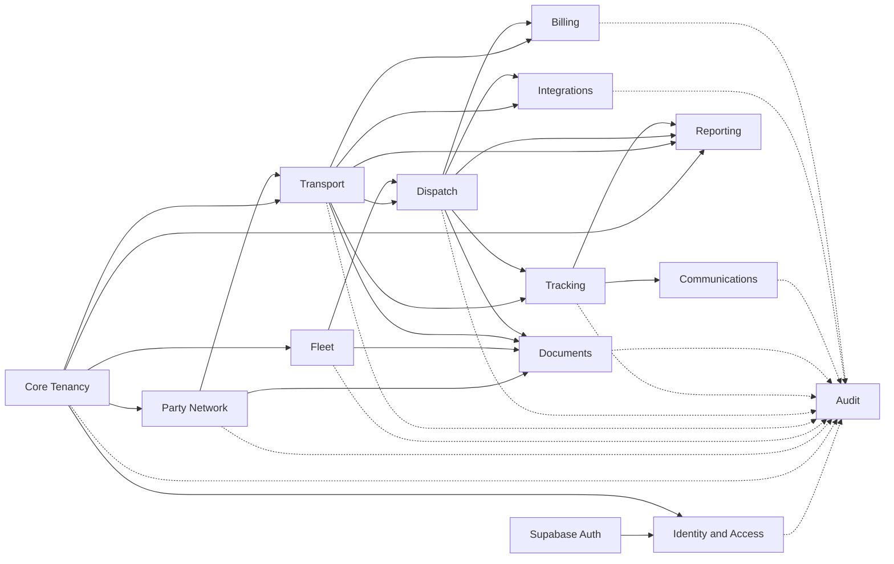
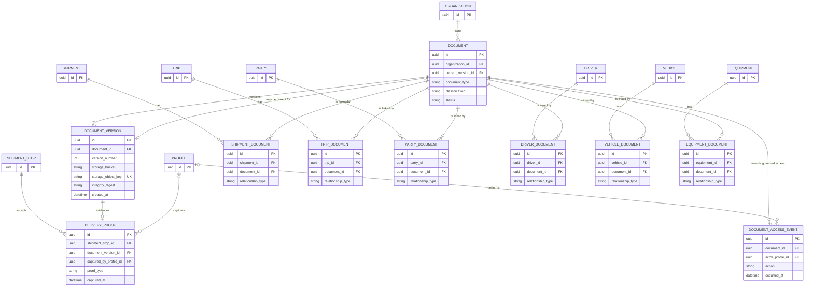
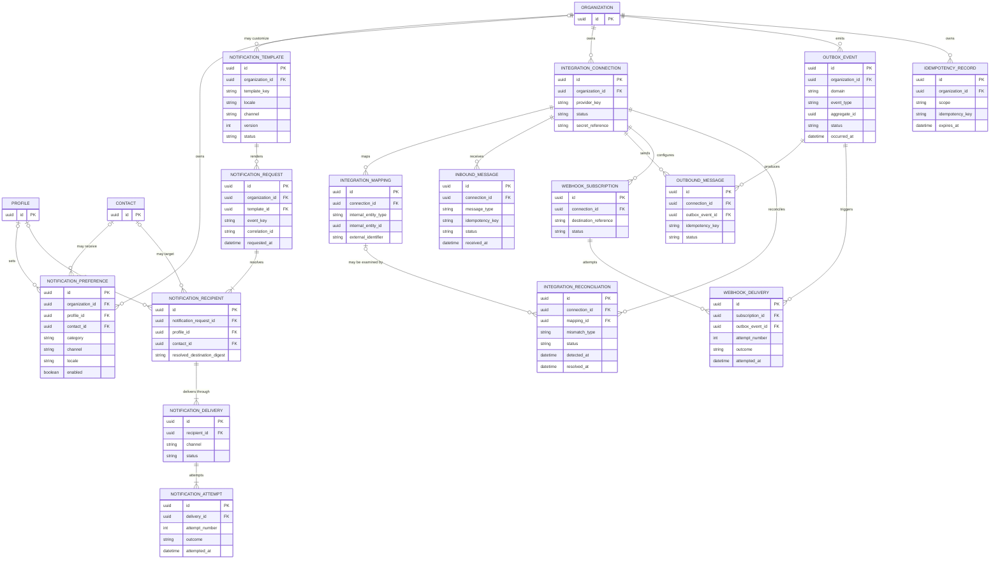

# Naqlia Conceptual Entity-Relationship Design

| Document field | Value                                                |
| -------------- | ---------------------------------------------------- |
| Status         | Approved conceptual ERD; not implemented             |
| Version        | 1.0                                                  |
| Architecture   | [Database Architecture](01-Database-Architecture.md) |
| Security       | [RLS Strategy](04-RLS-Strategy.md)                   |
| Last updated   | 2026-08-02                                           |

## 1. Purpose

This document represents Naqlia's major future entities and relationships. It is a logical design, not SQL, a physical schema, or a migration. Attributes shown are identity, tenancy, lifecycle, or relationship anchors; detailed business attributes require approved domain requirements before implementation.

The diagrams are split by bounded context so cardinality remains readable. The entity catalog in [Database Architecture](01-Database-Architecture.md#6-domain-catalog) defines ownership and semantics.

## 2. Notation

- `||` means exactly one.
- `o|` means zero or one.
- `|{` means one or more.
- `o{` means zero or more.
- `PK` marks the conceptual primary identity.
- `FK` marks a required or optional relationship identity.
- `UK` marks an alternate uniqueness rule.
- Every application-owned tenant entity also carries immutable `organization_id`, even when a diagram omits the repeated relationship for readability.
- Every mutable aggregate root carries lifecycle timestamps and `version`; immutable event entities carry `occurred_at` and `recorded_at`.

## 3. Global Domain Context

## 4. Core Tenancy and Identity ERD

```mermaid
erDiagram
  AUTH_USER {
    uuid id PK
  }

  PROFILE {
    uuid id PK
    uuid auth_user_id UK
    string status
  }

  ORGANIZATION {
    uuid id PK
    string slug UK
    string status
    string default_locale
    string timezone
  }

  ORGANIZATION_SETTING {
    uuid id PK
    uuid organization_id FK
    int version
    datetime effective_from
  }

  REFERENCE_VALUE {
    uuid id PK
    string category_key
    string value_key
    string status
  }

  ORGANIZATION_REFERENCE_VALUE {
    uuid id PK
    uuid organization_id FK
    uuid base_reference_value_id FK
    string category_key
    string value_key
    string status
  }

  BUSINESS_UNIT {
    uuid id PK
    uuid organization_id FK
    uuid parent_id FK
    string code
    string status
  }

  LOCATION {
    uuid id PK
    uuid organization_id FK
    uuid business_unit_id FK
    string code
    string location_type
  }

  ORGANIZATION_MEMBERSHIP {
    uuid id PK
    uuid organization_id FK
    uuid profile_id FK
    string status
    boolean organization_wide
    int authorization_version
  }

  PERMISSION_DEFINITION {
    uuid id PK
    string permission_key UK
    string domain
    string status
  }

  ROLE_DEFINITION {
    uuid id PK
    uuid organization_id FK
    string role_key
    boolean system_managed
    string status
  }

  ROLE_PERMISSION {
    uuid id PK
    uuid role_id FK
    uuid permission_id FK
  }

  MEMBERSHIP_ROLE {
    uuid id PK
    uuid membership_id FK
    uuid role_id FK
    datetime valid_from
    datetime valid_until
  }

  MEMBERSHIP_BUSINESS_UNIT_SCOPE {
    uuid id PK
    uuid membership_id FK
    uuid business_unit_id FK
    boolean include_descendants
  }

  SERVICE_PRINCIPAL {
    uuid id PK
    uuid organization_id FK
    string principal_key
    string status
    string secret_reference
  }

  SERVICE_PRINCIPAL_GRANT {
    uuid id PK
    uuid service_principal_id FK
    uuid permission_id FK
    uuid business_unit_id FK
    datetime valid_until
  }

  PLATFORM_ACCESS_GRANT {
    uuid id PK
    uuid profile_id FK
    uuid organization_id FK
    string access_level
    string reason
    datetime valid_until
  }

  ACCESS_REVIEW {
    uuid id PK
    uuid organization_id FK
    uuid reviewer_profile_id FK
    string scope_type
    string status
    datetime due_at
  }

  ACCESS_REVIEW_ITEM {
    uuid id PK
    uuid access_review_id FK
    uuid membership_id FK
    uuid platform_access_grant_id FK
    string decision
    datetime decided_at
  }

  ORGANIZATION_CONNECTION {
    uuid id PK
    uuid source_organization_id FK
    uuid target_organization_id FK
    string purpose
    string status
  }

  RESOURCE_SHARE {
    uuid id PK
    uuid organization_connection_id FK
    string resource_type
    uuid resource_id
    string permission_level
    datetime valid_until
  }

  AUTH_USER ||--o| PROFILE : "maps to"
  PROFILE ||--o{ ORGANIZATION_MEMBERSHIP : "participates through"
  ORGANIZATION ||--o{ ORGANIZATION_MEMBERSHIP : "has"
  ORGANIZATION ||--o{ ORGANIZATION_SETTING : "versions"
  ORGANIZATION ||--o{ ORGANIZATION_REFERENCE_VALUE : "defines"
  REFERENCE_VALUE o|--o{ ORGANIZATION_REFERENCE_VALUE : "may be extended by"
  ORGANIZATION ||--o{ BUSINESS_UNIT : "contains"
  BUSINESS_UNIT o|--o{ BUSINESS_UNIT : "parents"
  ORGANIZATION ||--o{ LOCATION : "owns"
  BUSINESS_UNIT o|--o{ LOCATION : "scopes"
  ORGANIZATION ||--o{ ROLE_DEFINITION : "owns custom"
  ROLE_DEFINITION ||--o{ ROLE_PERMISSION : "grants"
  PERMISSION_DEFINITION ||--o{ ROLE_PERMISSION : "is granted by"
  ORGANIZATION_MEMBERSHIP ||--o{ MEMBERSHIP_ROLE : "receives"
  ROLE_DEFINITION ||--o{ MEMBERSHIP_ROLE : "is assigned through"
  ORGANIZATION_MEMBERSHIP ||--o{ MEMBERSHIP_BUSINESS_UNIT_SCOPE : "is scoped by"
  BUSINESS_UNIT ||--o{ MEMBERSHIP_BUSINESS_UNIT_SCOPE : "limits"
  ORGANIZATION ||--o{ SERVICE_PRINCIPAL : "owns"
  SERVICE_PRINCIPAL ||--o{ SERVICE_PRINCIPAL_GRANT : "receives"
  PERMISSION_DEFINITION ||--o{ SERVICE_PRINCIPAL_GRANT : "is granted by"
  BUSINESS_UNIT o|--o{ SERVICE_PRINCIPAL_GRANT : "may scope"
  PROFILE ||--o{ PLATFORM_ACCESS_GRANT : "may receive"
  ORGANIZATION o|--o{ PLATFORM_ACCESS_GRANT : "may limit"
  ORGANIZATION o|--o{ ACCESS_REVIEW : "scopes"
  PROFILE ||--o{ ACCESS_REVIEW : "reviews"
  ACCESS_REVIEW ||--|{ ACCESS_REVIEW_ITEM : "contains"
  ORGANIZATION_MEMBERSHIP o|--o{ ACCESS_REVIEW_ITEM : "may be certified by"
  PLATFORM_ACCESS_GRANT o|--o{ ACCESS_REVIEW_ITEM : "may be certified by"
  ORGANIZATION ||--o{ ORGANIZATION_CONNECTION : "initiates"
  ORGANIZATION ||--o{ ORGANIZATION_CONNECTION : "receives"
  ORGANIZATION_CONNECTION ||--o{ RESOURCE_SHARE : "authorizes"
```

### 4.1 Identity invariants

- `PROFILE.auth_user_id` uniquely references only `AUTH_USER.id`, the managed primary key.
- A profile has at most one active membership per organization.
- A membership cannot receive a role owned by another organization, except an approved system role template resolved into that organization.
- `organization_wide = true` and explicit business-unit scopes are mutually exclusive.
- Platform grants are never derived from tenant roles and always expire.
- Service principal secrets are external references; secret material is not stored in these entities.
- An access review item references exactly one review subject: a membership or a platform access grant.
- Organization reference keys are unique within organization and category; an optional base reference must belong to the same approved category.

## 5. Party Network and Fleet ERD

```mermaid
erDiagram
  ORGANIZATION {
    uuid id PK
  }

  PROFILE {
    uuid id PK
  }

  PARTY {
    uuid id PK
    uuid organization_id FK
    string party_type
    string display_name
    string status
  }

  PARTY_ROLE {
    uuid id PK
    uuid party_id FK
    string role_type
    datetime valid_from
    datetime valid_until
  }

  PARTY_RELATIONSHIP {
    uuid id PK
    uuid organization_id FK
    uuid source_party_id FK
    uuid target_party_id FK
    string relationship_type
  }

  CONTACT {
    uuid id PK
    uuid organization_id FK
    string display_name
    string status
  }

  ADDRESS {
    uuid id PK
    uuid organization_id FK
    string country_code
    string city
    string normalized_hash
  }

  PARTY_CONTACT {
    uuid id PK
    uuid party_id FK
    uuid contact_id FK
    string contact_role
  }

  PARTY_ADDRESS {
    uuid id PK
    uuid party_id FK
    uuid address_id FK
    string address_role
  }

  EXTERNAL_PARTY_REFERENCE {
    uuid id PK
    uuid party_id FK
    string namespace
    string external_identifier
  }

  DRIVER {
    uuid id PK
    uuid organization_id FK
    uuid profile_id FK
    uuid business_unit_id FK
    string status
  }

  VEHICLE {
    uuid id PK
    uuid organization_id FK
    uuid business_unit_id FK
    string fleet_number
    string status
  }

  EQUIPMENT {
    uuid id PK
    uuid organization_id FK
    uuid business_unit_id FK
    string equipment_type
    string status
  }

  DRIVER_AVAILABILITY {
    uuid id PK
    uuid driver_id FK
    datetime starts_at
    datetime ends_at
    string availability_type
  }

  VEHICLE_AVAILABILITY {
    uuid id PK
    uuid vehicle_id FK
    datetime starts_at
    datetime ends_at
    string availability_type
  }

  EQUIPMENT_AVAILABILITY {
    uuid id PK
    uuid equipment_id FK
    datetime starts_at
    datetime ends_at
    string availability_type
  }

  DRIVER_VEHICLE_ASSIGNMENT {
    uuid id PK
    uuid driver_id FK
    uuid vehicle_id FK
    datetime valid_from
    datetime valid_until
  }

  VEHICLE_MAINTENANCE_RECORD {
    uuid id PK
    uuid vehicle_id FK
    string maintenance_type
    string status
    datetime performed_at
  }

  EQUIPMENT_MAINTENANCE_RECORD {
    uuid id PK
    uuid equipment_id FK
    string maintenance_type
    string status
    datetime performed_at
  }

  COMPLIANCE_REQUIREMENT {
    uuid id PK
    uuid organization_id FK
    string resource_type
    string requirement_key
  }

  DRIVER_COMPLIANCE_RECORD {
    uuid id PK
    uuid driver_id FK
    uuid requirement_id FK
    datetime valid_until
    string status
  }

  VEHICLE_COMPLIANCE_RECORD {
    uuid id PK
    uuid vehicle_id FK
    uuid requirement_id FK
    datetime valid_until
    string status
  }

  EQUIPMENT_COMPLIANCE_RECORD {
    uuid id PK
    uuid equipment_id FK
    uuid requirement_id FK
    datetime valid_until
    string status
  }

  DRIVER_EXTERNAL_REFERENCE {
    uuid id PK
    uuid driver_id FK
    string namespace
    string external_identifier
  }

  VEHICLE_EXTERNAL_REFERENCE {
    uuid id PK
    uuid vehicle_id FK
    string namespace
    string external_identifier
  }

  EQUIPMENT_EXTERNAL_REFERENCE {
    uuid id PK
    uuid equipment_id FK
    string namespace
    string external_identifier
  }

  ORGANIZATION ||--o{ PARTY : "owns"
  PARTY ||--o{ PARTY_ROLE : "acts as"
  PARTY ||--o{ PARTY_RELATIONSHIP : "is source"
  PARTY ||--o{ PARTY_RELATIONSHIP : "is target"
  ORGANIZATION ||--o{ CONTACT : "owns"
  ORGANIZATION ||--o{ ADDRESS : "owns"
  PARTY ||--o{ PARTY_CONTACT : "uses"
  CONTACT ||--o{ PARTY_CONTACT : "serves"
  PARTY ||--o{ PARTY_ADDRESS : "uses"
  ADDRESS ||--o{ PARTY_ADDRESS : "serves"
  PARTY ||--o{ EXTERNAL_PARTY_REFERENCE : "is identified by"
  ORGANIZATION ||--o{ DRIVER : "owns"
  PROFILE o|--o| DRIVER : "may represent"
  ORGANIZATION ||--o{ VEHICLE : "owns"
  ORGANIZATION ||--o{ EQUIPMENT : "owns"
  DRIVER ||--o{ DRIVER_AVAILABILITY : "has"
  VEHICLE ||--o{ VEHICLE_AVAILABILITY : "has"
  EQUIPMENT ||--o{ EQUIPMENT_AVAILABILITY : "has"
  DRIVER ||--o{ DRIVER_VEHICLE_ASSIGNMENT : "is assigned"
  VEHICLE ||--o{ DRIVER_VEHICLE_ASSIGNMENT : "receives"
  VEHICLE ||--o{ VEHICLE_MAINTENANCE_RECORD : "undergoes"
  EQUIPMENT ||--o{ EQUIPMENT_MAINTENANCE_RECORD : "undergoes"
  ORGANIZATION ||--o{ COMPLIANCE_REQUIREMENT : "defines"
  DRIVER ||--o{ DRIVER_COMPLIANCE_RECORD : "satisfies"
  COMPLIANCE_REQUIREMENT ||--o{ DRIVER_COMPLIANCE_RECORD : "governs"
  VEHICLE ||--o{ VEHICLE_COMPLIANCE_RECORD : "satisfies"
  COMPLIANCE_REQUIREMENT ||--o{ VEHICLE_COMPLIANCE_RECORD : "governs"
  EQUIPMENT ||--o{ EQUIPMENT_COMPLIANCE_RECORD : "satisfies"
  COMPLIANCE_REQUIREMENT ||--o{ EQUIPMENT_COMPLIANCE_RECORD : "governs"
  DRIVER ||--o{ DRIVER_EXTERNAL_REFERENCE : "is identified by"
  VEHICLE ||--o{ VEHICLE_EXTERNAL_REFERENCE : "is identified by"
  EQUIPMENT ||--o{ EQUIPMENT_EXTERNAL_REFERENCE : "is identified by"
```

### 5.1 Network and fleet invariants

- Source and target parties in a relationship belong to the same organization and are different records.
- Party role, contact, and address assignments are effective-dated when historical use matters.
- A driver may link to at most one profile; a profile may represent at most one driver per organization.
- Availability intervals cannot have a negative duration and overlapping exclusive intervals require controlled resolution.
- Compliance requirement type must match the type-specific compliance record.
- Each external identifier is unique within organization, namespace, and resource type.

## 6. Transport, Dispatch, and Tracking ERD

```mermaid
erDiagram
  ORGANIZATION {
    uuid id PK
  }

  PROFILE {
    uuid id PK
  }

  BUSINESS_UNIT {
    uuid id PK
  }

  PARTY {
    uuid id PK
  }

  LOCATION {
    uuid id PK
  }

  DRIVER {
    uuid id PK
  }

  VEHICLE {
    uuid id PK
  }

  EQUIPMENT {
    uuid id PK
  }

  INTEGRATION_CONNECTION {
    uuid id PK
  }

  TRANSPORT_ORDER {
    uuid id PK
    uuid organization_id FK
    uuid business_unit_id FK
    string order_number
    string status
    int version
  }

  SHIPMENT {
    uuid id PK
    uuid organization_id FK
    uuid transport_order_id FK
    string shipment_number
    string status
    int version
  }

  SHIPMENT_ITEM {
    uuid id PK
    uuid shipment_id FK
    string item_type
    decimal quantity
    decimal weight
  }

  SHIPMENT_STOP {
    uuid id PK
    uuid shipment_id FK
    uuid location_id FK
    int sequence_number
    string stop_type
    datetime planned_window_start
    datetime planned_window_end
  }

  SHIPMENT_PARTY {
    uuid id PK
    uuid shipment_id FK
    uuid party_id FK
    string party_role
  }

  SHIPMENT_REFERENCE {
    uuid id PK
    uuid shipment_id FK
    string namespace
    string reference_value
  }

  SHIPMENT_STATUS_EVENT {
    uuid id PK
    uuid shipment_id FK
    string from_status
    string to_status
    datetime occurred_at
    datetime recorded_at
  }

  SHIPMENT_NOTE {
    uuid id PK
    uuid shipment_id FK
    uuid author_profile_id FK
    string visibility_class
    datetime created_at
  }

  SHIPMENT_EXTERNAL_REFERENCE {
    uuid id PK
    uuid shipment_id FK
    uuid integration_connection_id FK
    string namespace
    string external_identifier
  }

  TRIP {
    uuid id PK
    uuid organization_id FK
    uuid business_unit_id FK
    string trip_number
    string status
    int version
  }

  TRIP_STOP {
    uuid id PK
    uuid trip_id FK
    uuid location_id FK
    int sequence_number
    datetime planned_arrival_at
    datetime actual_arrival_at
  }

  SHIPMENT_LEG {
    uuid id PK
    uuid shipment_id FK
    uuid trip_id FK
    uuid origin_shipment_stop_id FK
    uuid destination_shipment_stop_id FK
    int leg_sequence
    string status
  }

  TRIP_STOP_TASK {
    uuid id PK
    uuid trip_stop_id FK
    uuid shipment_leg_id FK
    string task_type
    string status
  }

  TRIP_RESOURCE_ASSIGNMENT {
    uuid id PK
    uuid trip_id FK
    uuid driver_id FK
    uuid vehicle_id FK
    uuid equipment_id FK
    string assignment_role
    datetime valid_from
    datetime valid_until
  }

  DISPATCH_STATUS_EVENT {
    uuid id PK
    uuid trip_id FK
    string from_status
    string to_status
    datetime occurred_at
    datetime recorded_at
  }

  DISPATCH_DECISION {
    uuid id PK
    uuid trip_id FK
    uuid decided_by_profile_id FK
    string decision_type
    string reason_code
    datetime decided_at
  }

  CAPACITY_RESERVATION {
    uuid id PK
    uuid organization_id FK
    uuid shipment_id FK
    uuid driver_id FK
    uuid vehicle_id FK
    uuid equipment_id FK
    datetime starts_at
    datetime ends_at
    string status
  }

  TRACKING_SESSION {
    uuid id PK
    uuid trip_id FK
    uuid driver_id FK
    uuid vehicle_id FK
    string source_type
    datetime started_at
    datetime ended_at
  }

  POSITION_OBSERVATION {
    uuid id PK
    uuid tracking_session_id FK
    datetime occurred_at
    datetime recorded_at
    decimal latitude
    decimal longitude
    decimal accuracy_meters
  }

  TRACKING_SOURCE_HEALTH {
    uuid id PK
    uuid tracking_session_id FK
    string health_status
    datetime observed_at
  }

  MILESTONE_EVENT {
    uuid id PK
    uuid shipment_id FK
    uuid shipment_stop_id FK
    uuid trip_id FK
    string milestone_type
    datetime occurred_at
  }

  ETA_ESTIMATE {
    uuid id PK
    uuid shipment_stop_id FK
    uuid trip_stop_id FK
    datetime estimated_at
    datetime estimated_arrival_at
    string source_version
  }

  OPERATIONAL_EXCEPTION {
    uuid id PK
    uuid organization_id FK
    uuid shipment_id FK
    uuid trip_id FK
    string exception_type
    string severity
    string status
    int version
  }

  EXCEPTION_EVENT {
    uuid id PK
    uuid operational_exception_id FK
    string event_type
    datetime occurred_at
  }

  ORGANIZATION ||--o{ TRANSPORT_ORDER : "owns"
  BUSINESS_UNIT o|--o{ TRANSPORT_ORDER : "scopes"
  TRANSPORT_ORDER ||--|{ SHIPMENT : "contains"
  SHIPMENT ||--o{ SHIPMENT_ITEM : "contains"
  SHIPMENT ||--|{ SHIPMENT_STOP : "requires"
  LOCATION o|--o{ SHIPMENT_STOP : "references"
  SHIPMENT ||--o{ SHIPMENT_PARTY : "involves"
  PARTY ||--o{ SHIPMENT_PARTY : "participates"
  SHIPMENT ||--o{ SHIPMENT_REFERENCE : "is identified by"
  SHIPMENT ||--|{ SHIPMENT_STATUS_EVENT : "records"
  SHIPMENT ||--o{ SHIPMENT_NOTE : "has"
  PROFILE ||--o{ SHIPMENT_NOTE : "authors"
  SHIPMENT ||--o{ SHIPMENT_EXTERNAL_REFERENCE : "is identified by"
  INTEGRATION_CONNECTION o|--o{ SHIPMENT_EXTERNAL_REFERENCE : "names within"
  ORGANIZATION ||--o{ TRIP : "owns"
  BUSINESS_UNIT o|--o{ TRIP : "scopes"
  TRIP ||--|{ TRIP_STOP : "sequences"
  LOCATION o|--o{ TRIP_STOP : "references"
  SHIPMENT ||--o{ SHIPMENT_LEG : "is executed by"
  TRIP ||--o{ SHIPMENT_LEG : "carries"
  SHIPMENT_STOP ||--o{ SHIPMENT_LEG : "originates"
  SHIPMENT_STOP ||--o{ SHIPMENT_LEG : "terminates"
  TRIP_STOP ||--o{ TRIP_STOP_TASK : "requires"
  SHIPMENT_LEG o|--o{ TRIP_STOP_TASK : "is served by"
  TRIP ||--o{ TRIP_RESOURCE_ASSIGNMENT : "uses"
  DRIVER o|--o{ TRIP_RESOURCE_ASSIGNMENT : "is assigned"
  VEHICLE o|--o{ TRIP_RESOURCE_ASSIGNMENT : "is assigned"
  EQUIPMENT o|--o{ TRIP_RESOURCE_ASSIGNMENT : "is assigned"
  TRIP ||--|{ DISPATCH_STATUS_EVENT : "records"
  TRIP ||--o{ DISPATCH_DECISION : "is governed by"
  PROFILE ||--o{ DISPATCH_DECISION : "makes"
  ORGANIZATION ||--o{ CAPACITY_RESERVATION : "owns"
  SHIPMENT o|--o{ CAPACITY_RESERVATION : "may require"
  DRIVER o|--o{ CAPACITY_RESERVATION : "may reserve"
  VEHICLE o|--o{ CAPACITY_RESERVATION : "may reserve"
  EQUIPMENT o|--o{ CAPACITY_RESERVATION : "may reserve"
  TRIP ||--o{ TRACKING_SESSION : "is observed by"
  DRIVER o|--o{ TRACKING_SESSION : "may source"
  VEHICLE o|--o{ TRACKING_SESSION : "may source"
  TRACKING_SESSION ||--o{ POSITION_OBSERVATION : "captures"
  TRACKING_SESSION ||--o{ TRACKING_SOURCE_HEALTH : "reports"
  SHIPMENT ||--o{ MILESTONE_EVENT : "reaches"
  SHIPMENT_STOP o|--o{ MILESTONE_EVENT : "may locate"
  TRIP o|--o{ MILESTONE_EVENT : "may execute"
  SHIPMENT_STOP o|--o{ ETA_ESTIMATE : "receives"
  TRIP_STOP o|--o{ ETA_ESTIMATE : "receives"
  ORGANIZATION ||--o{ OPERATIONAL_EXCEPTION : "owns"
  SHIPMENT o|--o{ OPERATIONAL_EXCEPTION : "may encounter"
  TRIP o|--o{ OPERATIONAL_EXCEPTION : "may encounter"
  OPERATIONAL_EXCEPTION ||--|{ EXCEPTION_EVENT : "records"
```

### 6.1 Transport invariants

- Order, shipment, leg, trip, resources, parties, and locations linked by an operational workflow must share one organization.
- Shipment stop and trip stop sequence numbers are unique inside their parent and begin at one.
- A shipment leg's origin and destination belong to the same shipment and follow valid stop order.
- A trip resource assignment contains exactly one resource for the declared assignment role, except an approved composite team assignment model.
- A capacity reservation references exactly one driver, vehicle, or equipment record, and the resource belongs to the reservation organization.
- Shipment external references are unique within connection, namespace, and external identifier.
- A tracking session belongs to one trip; source driver and vehicle are optional but must be assigned to that trip for the observation period.
- An ETA estimate targets exactly one shipment stop or one trip stop.
- An exception targets at least one shipment or trip and cannot point outside its organization.

## 7. Documents and Proof ERD

### 7.1 Document invariants

- Document and linked domain entity share one organization.
- Version numbers are unique and increasing within a document.
- Current version references one version of the same document.
- A proof references the immutable document version reviewed at capture time, not only the mutable current version.
- Stored object integrity digest and size are immutable after version acceptance.

## 8. Communications and Integration ERD

### 8.1 Communication and integration invariants

- A preference or recipient targets one profile or one contact, never both.
- Notification templates are unique by owner, key, locale, channel, and version.
- Delivery and webhook attempt numbers are unique and increasing within their parent.
- Integration mapping is the approved exception to real foreign keys across every domain; the owning adapter validates the typed internal identity and reconciliation detects orphaned mappings.
- Idempotency keys are unique within organization, scope, and validity period.
- A closed reconciliation preserves its resolution event and never rewrites the original inbound or outbound message.

## 9. Billing, Audit, Reporting, and Platform ERD

```mermaid
erDiagram
  ORGANIZATION {
    uuid id PK
  }

  PROFILE {
    uuid id PK
  }

  SERVICE_PRINCIPAL {
    uuid id PK
  }

  PLATFORM_ACCESS_GRANT {
    uuid id PK
  }

  PARTY {
    uuid id PK
  }

  SHIPMENT {
    uuid id PK
  }

  TRIP {
    uuid id PK
  }

  BILLING_ACCOUNT {
    uuid id PK
    uuid organization_id FK
    string currency_code
    string status
  }

  SUBSCRIPTION_PLAN {
    uuid id PK
    string plan_key
    int version
    string status
  }

  SUBSCRIPTION {
    uuid id PK
    uuid billing_account_id FK
    uuid plan_id FK
    string status
    datetime period_start
    datetime period_end
  }

  RATE_AGREEMENT {
    uuid id PK
    uuid organization_id FK
    uuid party_id FK
    string currency_code
    datetime valid_from
    datetime valid_until
  }

  CHARGE {
    uuid id PK
    uuid organization_id FK
    uuid shipment_id FK
    uuid trip_id FK
    string charge_type
    decimal amount
    string currency_code
    string status
  }

  INVOICE {
    uuid id PK
    uuid billing_account_id FK
    string invoice_number
    string currency_code
    string status
    datetime issued_at
  }

  INVOICE_LINE {
    uuid id PK
    uuid invoice_id FK
    uuid charge_id FK
    decimal amount
    string currency_code
  }

  PAYMENT_ALLOCATION {
    uuid id PK
    uuid invoice_id FK
    string external_payment_reference
    decimal amount
    string currency_code
    datetime allocated_at
  }

  USAGE_RECORD {
    uuid id PK
    uuid organization_id FK
    string metric_key
    decimal quantity
    datetime period_start
    datetime period_end
  }

  AUDIT_EVENT {
    uuid id PK
    uuid organization_id FK
    uuid actor_profile_id FK
    uuid actor_service_principal_id FK
    uuid platform_access_grant_id FK
    string actor_type
    string action
    string target_type
    uuid target_id
    string outcome
    datetime occurred_at
    datetime recorded_at
    string retention_class
    string event_hash
  }

  AUDIT_EVENT_DETAIL {
    uuid id PK
    uuid audit_event_id FK
    string detail_class
    string integrity_digest
  }

  LEGAL_HOLD {
    uuid id PK
    uuid organization_id FK
    string hold_scope
    string status
    datetime starts_at
    datetime released_at
  }

  REPORT_DEFINITION {
    uuid id PK
    string report_key
    string required_permission
    int version
  }

  REPORT_RUN {
    uuid id PK
    uuid organization_id FK
    uuid report_definition_id FK
    uuid requested_by_profile_id FK
    string status
    datetime expires_at
  }

  EXPORT_JOB {
    uuid id PK
    uuid organization_id FK
    uuid requested_by_profile_id FK
    string export_type
    string purpose_code
    string status
    datetime expires_at
  }

  METRIC_SNAPSHOT {
    uuid id PK
    uuid organization_id FK
    string metric_key
    int definition_version
    datetime period_start
    datetime period_end
  }

  FEATURE_DEFINITION {
    uuid id PK
    string feature_key UK
    string status
  }

  ORGANIZATION_ENTITLEMENT {
    uuid id PK
    uuid organization_id FK
    uuid feature_id FK
    datetime valid_from
    datetime valid_until
  }

  JOB_RUN {
    uuid id PK
    uuid organization_id FK
    string job_type
    string status
    int attempt_number
    datetime started_at
    datetime completed_at
  }

  CONFIGURATION_VERSION {
    uuid id PK
    string configuration_key
    int version
    string status
    datetime effective_at
  }

  ORGANIZATION ||--|| BILLING_ACCOUNT : "is billed through"
  BILLING_ACCOUNT ||--o{ SUBSCRIPTION : "holds"
  SUBSCRIPTION_PLAN ||--o{ SUBSCRIPTION : "governs"
  ORGANIZATION ||--o{ RATE_AGREEMENT : "owns"
  PARTY ||--o{ RATE_AGREEMENT : "negotiates"
  ORGANIZATION ||--o{ CHARGE : "owns"
  SHIPMENT o|--o{ CHARGE : "may originate"
  TRIP o|--o{ CHARGE : "may originate"
  BILLING_ACCOUNT ||--o{ INVOICE : "receives"
  INVOICE ||--|{ INVOICE_LINE : "contains"
  CHARGE o|--o{ INVOICE_LINE : "may support"
  INVOICE ||--o{ PAYMENT_ALLOCATION : "receives"
  ORGANIZATION ||--o{ USAGE_RECORD : "meters"
  ORGANIZATION o|--o{ AUDIT_EVENT : "scopes"
  PROFILE o|--o{ AUDIT_EVENT : "may perform"
  SERVICE_PRINCIPAL o|--o{ AUDIT_EVENT : "may perform"
  PLATFORM_ACCESS_GRANT o|--o{ AUDIT_EVENT : "may authorize"
  AUDIT_EVENT ||--o| AUDIT_EVENT_DETAIL : "may protect"
  ORGANIZATION o|--o{ LEGAL_HOLD : "places"
  REPORT_DEFINITION ||--o{ REPORT_RUN : "executes as"
  ORGANIZATION ||--o{ REPORT_RUN : "owns"
  PROFILE ||--o{ REPORT_RUN : "requests"
  ORGANIZATION ||--o{ EXPORT_JOB : "owns"
  PROFILE ||--o{ EXPORT_JOB : "requests"
  ORGANIZATION ||--o{ METRIC_SNAPSHOT : "aggregates"
  ORGANIZATION ||--o{ ORGANIZATION_ENTITLEMENT : "receives"
  FEATURE_DEFINITION ||--o{ ORGANIZATION_ENTITLEMENT : "enables"
  ORGANIZATION o|--o{ JOB_RUN : "may scope"
```

### 9.1 Billing and control-plane invariants

- An organization has one active billing account per commercial context.
- Monetary values always include currency and fixed precision; invoice and line currencies must match unless an approved conversion model exists.
- Charges and invoice lines are immutable after posting; corrections use reversal or adjustment records.
- Payment allocations are immutable application facts; correction uses an offsetting allocation and keeps the external payment reference.
- Audit target identity intentionally does not use a foreign key so evidence survives source deletion; target type and identifier are validated at capture time.
- Audit event detail is optional, separately protected, and integrity-bound to its parent.
- A legal hold prevents retention deletion for every record in its resolved scope.
- Report output expires and is access-checked again at download time.
- Export output is purpose-bound, expires, and is audited at creation and download; metric snapshots retain their definition version.

## 10. Relationship Registry

This registry clarifies the most important cross-domain dependencies.

| Source                 | Target                  | Cardinality                          | Required rule                                            |
| ---------------------- | ----------------------- | ------------------------------------ | -------------------------------------------------------- |
| Profile                | Auth user               | 1 to 1                               | Auth primary key is unique and immutable in the mapping. |
| Profile                | Organization membership | 1 to many                            | One active membership per organization.                  |
| Organization           | Tenant-owned entity     | 1 to many                            | Immutable tenant ownership on every tenant row.          |
| Business unit          | Business unit           | 0/1 parent to many children          | Same tenant, no cycles.                                  |
| Membership             | Role                    | Many to many                         | Effective-dated assignment and same tenant.              |
| Role                   | Permission              | Many to many                         | Only platform-defined permission keys.                   |
| Organization           | Party                   | 1 to many                            | Party is tenant-local, never global.                     |
| Transport order        | Shipment                | 1 to one-or-many                     | Same tenant; order may not be empty after activation.    |
| Shipment               | Shipment stop           | 1 to one-or-many                     | Ordered, unique sequence.                                |
| Shipment               | Shipment leg            | 1 to many                            | Sequential leg sequence and valid stop range.            |
| Trip                   | Shipment leg            | 1 to many                            | Same tenant and dispatch lifecycle.                      |
| Trip                   | Resource assignment     | 1 to many                            | Effective-dated, same-tenant resources.                  |
| Trip                   | Tracking session        | 1 to many                            | Authorized source and bounded lifecycle.                 |
| Tracking session       | Position observation    | 1 to many                            | Append-only, occurrence and receipt time.                |
| Operational root       | Status event            | 1 to many                            | Append-only event and atomic current-state update.       |
| Document               | Document version        | 1 to one-or-many                     | Immutable, increasing version.                           |
| Domain entity          | Document                | Many to many through typed link      | Same tenant and real foreign keys.                       |
| Domain event           | Outbox event            | 1 to 1 where publication is required | Same transaction and idempotent publication.             |
| Integration connection | Message                 | 1 to many                            | Tenant, provider, correlation, and idempotency.          |
| Governed action        | Audit event             | 1 to one-or-many                     | Same transaction for required audit evidence.            |

## 11. Prohibited Relationship Patterns

- No tenant-owned relationship may rely only on matching IDs without matching `organization_id`.
- No business entity may reference mutable Auth metadata for authorization.
- No generic `entity_type`/`entity_id` association is allowed except an explicitly approved control or external-boundary registry such as resource shares, audit targets, and integration mappings. Every exception requires a closed type allowlist, ownership validation, orphan reconciliation, and tests.
- No domain may use an audit event as its current-state source.
- No direct many-to-many relationship exists without an association entity carrying provenance and uniqueness.
- No mutable business identifier is used as a primary key.
- No cascade deletion may erase completed operational, financial, audit, or integration history.
- No cross-tenant relationship exists without an organization connection and explicit resource share.

## 12. Physical Design Checklist

Before implementation, a database engineer must turn every conceptual entity into a reviewed specification containing:

- owning schema and domain owner;
- primary key and immutable tenant key;
- full attributes, types, nullability, defaults, and classification;
- parent/child lifecycle and deletion behavior;
- unique, check, exclusion, and tenant-safe foreign-key rules;
- status values and allowed transition graph;
- RLS operation matrix and required permission keys;
- audit events and domain history requirements;
- expected access paths and indexes;
- partition and retention disposition;
- source-of-truth and integration mapping behavior;
- TypeScript contract and test cases;
- migration, backfill, rollback, and recovery plan.

No physical schema should be approved if it weakens a cardinality or invariant documented here without an ADR and corresponding documentation update.
