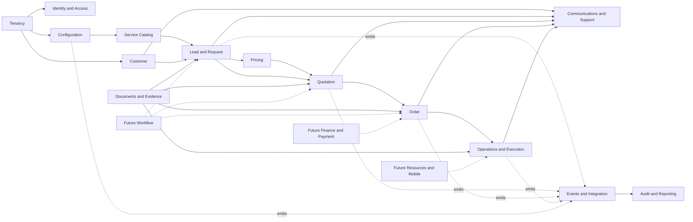

# Naqlia Complete Business Domain Model

| Document field         | Value                                                                                  |
| ---------------------- | -------------------------------------------------------------------------------------- |
| Suite                  | Domain Model Suite v1                                                                  |
| Status                 | Approved logical model; documentation only                                             |
| Version                | 1.0.0                                                                                  |
| Effective date         | 2026-08-03                                                                             |
| Parent                 | [Product Documentation Suite v1](../product/01-Business-Requirements-Specification.md) |
| Governing architecture | [Database Architecture](../01-Database-Architecture.md)                                |
| Owners                 | Product, Domain Architecture, Data Architecture, Security, and Engineering             |

## 1. Purpose

This suite is the definitive logical business model for implementing the Naqlia database. It resolves domain boundaries, aggregate ownership, entities, fields, relationships, lifecycles, events, deletion behavior, and future extension seams before any SQL, migration, Supabase resource, API, backend, or UI work begins.

It defines **what business facts exist and who owns them**. Physical PostgreSQL types, table/column design, indexes, constraint syntax, partitions, RLS policies, storage buckets, generated types, and migration order remain implementation-design work governed by the existing database documents.

## 2. Authority and Conflict Rules

The authority chain is:

1. [Naqlia Constitution](../../.ai/constitution.md);
2. [Master Project Blueprint](../00-Project-Blueprint.md);
3. approved PDS v1 product meaning and scope;
4. this Domain Model Suite for logical data meaning;
5. Database Architecture, Naming, RLS, and Audit documents for cross-cutting database controls; and
6. future physical design and ADRs.

If the pre-PDS [Conceptual ERD](../02-ERD.md) names a future entity that is not present here, that entity is **not approved for the PDS v1 schema**. If both documents describe the same concept differently, this suite controls business vocabulary and MVP cardinality; the database architecture continues to control tenancy, security, integrity, audit, and physical-design constraints. Conflicts MUST be resolved in documentation before implementation.

## 3. Normative Language and Identifiers

The terms **MUST**, **MUST NOT**, **SHOULD**, **SHOULD NOT**, and **MAY** express requirement strength.

Stable identifiers are permanent contracts:

- `DOM-*` identifies a domain;
- `ENT-*` identifies an entity in the [Entity Catalog](./02-Entity-Catalog.md);
- `REL-*` identifies a relationship in the [Relationship Matrix](./03-Relationship-Matrix.md);
- `FLD-*` identifies a field profile or entity field specification in the [Field Catalog](./04-Field-Catalog.md); and
- event names and versions are defined in [Domain Events](./05-Domain-Events.md).

An identifier is never reused after retirement. A changed business meaning requires a new identifier or explicit version.

## 4. Implementation Dispositions

| Code         | Meaning                                                                                    | Database implementation effect                                         |
| ------------ | ------------------------------------------------------------------------------------------ | ---------------------------------------------------------------------- |
| `FOUNDATION` | Cross-cutting record required before or with the first MVP slice                           | Include when its owning capability is implemented                      |
| `MVP`        | Required by approved PDS v1                                                                | Eligible for implementation after Definition of Ready                  |
| `FUTURE`     | Named compatibility seam for an approved architectural direction but not MVP product scope | Do not create physical storage until a future PDS change authorizes it |
| `PROJECTION` | Derived/read model that may be introduced only for measured access or reporting need       | Never make it the operational source of truth                          |

Future entities are defined to prevent incompatible MVP choices. Their presence is not authorization to implement fleet, live tracking, public APIs, workflow automation, online payments, invoicing, or advanced analytics.

## 5. Ubiquitous Language

| Term                   | Canonical meaning                                                                                                                              |
| ---------------------- | ---------------------------------------------------------------------------------------------------------------------------------------------- |
| Organization           | Immutable tenant/company ownership boundary. The MVP has one Naqlia operating organization.                                                    |
| Customer               | Tenant-local person or business requesting/receiving service; may exist without an account.                                                    |
| Profile                | Application representation of one authenticated human identity.                                                                                |
| Guest Customer         | Customer without a linked Profile; authorization is purpose-bound verification, not tenant membership.                                         |
| Registered Customer    | Customer linked to a Profile; linkage does not make the customer an internal organization member.                                              |
| Lead                   | Structured Sales record created exactly once from a valid customer request.                                                                    |
| Cargo Service          | What is transported: Furniture Moving or General Cargo Transport in MVP.                                                                       |
| Route Class            | Where movement occurs: Local Transport or Intercity Transport in MVP.                                                                          |
| Service Offering       | Enabled Cargo Service + Route Class combination in a governed market/coverage context.                                                         |
| Add-on                 | Optional non-standalone service: Packing or Loading & Unloading in MVP.                                                                        |
| Internal Estimate      | Staff-only price guidance; never a customer commitment.                                                                                        |
| Quotation              | Commercial aggregate containing immutable, customer-addressable versions.                                                                      |
| Approved milestone     | Current Quotation version is accepted by the customer, all required approvals are current, and Order conversion succeeds.                      |
| Order                  | Executable service commitment created exactly once from one accepted, approved Quotation version.                                              |
| Order Service Snapshot | Immutable operational copy of the accepted customer, service, route, cargo, add-on, terms, and commercial context needed to execute the Order. |
| Schedule Revision      | Append-only revision of the current planned service window and its reason/communication outcome.                                               |
| Execution              | Operational performance of an Order; one active Execution is permitted in MVP.                                                                 |
| Operational Exception  | Separately owned issue that may block or affect Execution without overwriting lifecycle history.                                               |
| Customer Status        | Privacy-minimized localized projection of internal lifecycle state.                                                                            |
| Domain Event           | Immutable business fact emitted by an owning aggregate.                                                                                        |
| Audit Event            | Immutable evidence of a governed action/access; not a substitute for domain history.                                                           |
| Configuration Release  | Reviewed, effective-dated set of business configuration versions activated together.                                                           |

`Shipment`, `trip`, `dispatch`, `driver app`, `invoice`, and `payment` are not synonyms for MVP Order or Execution. Their future models remain separate and require explicit product approval.

## 6. Domain Context Map

Solid arrows are approved dependency direction. Dotted arrows are future seams. An arrow permits dependency on a published contract; it never permits another domain to mutate the owner's internal records directly.

## 7. Domain Catalog

### 7.1 `DOM-TEN` — Tenancy and Organization

**Purpose:** provide the immutable company/tenant boundary and optional internal operating scopes.

**Responsibilities:** organization identity/lifecycle, organization defaults, business-unit hierarchy, and future explicit cross-company collaboration.

**Owned entities:** Organization, Organization Setting, Business Unit, Organization Connection, Resource Share.

**Dependencies:** none inside the application model. Authentication and Supabase tenancy infrastructure are external platform dependencies.

**Future scalability:** every tenant-owned record carries immutable organization ownership; organization connections and resource shares provide explicit future collaboration without global data or tenant reassignment. Database-per-tenant remains a measured future decision.

### 7.2 `DOM-IAM` — Identity and Access

**Purpose:** represent authenticated humans and machines and authorize their participation in an Organization.

**Responsibilities:** Auth-to-Profile mapping, memberships, roles, permission grants, business-unit scope, service principals, privileged platform access, access review, and future device registration.

**Owned entities:** Profile, Organization Membership, Permission Definition, Role Definition, Role Permission, Membership Role, Membership Business Unit Scope, Service Principal, Service Principal Grant, Platform Access Grant, Access Review, Device Registration.

**Dependencies:** Tenancy; Supabase Auth as external credential/session authority.

**Future scalability:** a Profile may join multiple Organizations; customer account links remain separate from workforce memberships; machine and mobile identities are independently revocable and least-privilege.

### 7.3 `DOM-CFG` — Configuration Governance

**Purpose:** keep approved business values out of source code while preserving validation, version, approval, activation, history, and rollback.

**Responsibilities:** semantic definition of configuration keys, value versions, release grouping, effective dates, validation contracts, scope, localization, and publication evidence.

**Owned entities:** Configuration Definition, Configuration Version, Configuration Release, Configuration Release Item.

**Dependencies:** Tenancy and Identity/Access.

**Future scalability:** configuration can resolve by platform, Organization, business unit, market, locale, service, or another explicitly modeled scope. Resolution MUST be deterministic and conflicts fail safely. Security, tenant isolation, audit immutability, lifecycle integrity, and mandatory Sales review are never configurable.

### 7.4 `DOM-CAT` — Service Catalog and Eligibility

**Purpose:** define what Naqlia offers, where it is eligible, what information is required, and which restrictions apply.

**Responsibilities:** Cargo Services, Route Classes, add-ons, offerings, coverage, lanes, qualification fields, restrictions, reason definitions, localized content, and customer-status mappings.

**Owned entities:** Service Definition, Route Class Definition, Add-on Definition, Service Offering, Offering Add-on, Coverage Area, Service Lane, Qualification Field Definition, Offering Qualification Field, Restriction Definition, Offering Restriction, Customer Status Mapping, Reason Definition.

**Dependencies:** Tenancy, Configuration Governance, and Identity/Access.

**Future scalability:** effective-dated catalog entries and lanes support additional cities, services, add-ons, markets, and locales without changing historical facts or branching application code.

### 7.5 `DOM-CUS` — Customer and Consent

**Purpose:** maintain the tenant-local customer identity, contact, address, account link, consent, preference, and feedback facts required for service.

**Responsibilities:** guest/registered continuity, verified contact points, customer addresses, explicit Profile linkage, privacy evidence, communication preference, duplicate resolution, and future feedback.

**Owned entities:** Customer, Contact Point, Customer Address, Customer Account Link, Consent Record, Communication Preference, Customer Feedback.

**Dependencies:** Tenancy; optional Profile dependency on Identity/Access.

**Future scalability:** the same real-world customer may be represented independently by different Organizations; linking, merging, cross-company identity resolution, and business-account delegation require explicit provenance and policy.

### 7.6 `DOM-LED` — Request Intake and Lead

**Purpose:** turn one valid customer submission into one attributable Sales record and retain the facts required to qualify it.

**Responsibilities:** source/idempotency, customer/request snapshot, service selection, locations, cargo, add-ons, assignment, lifecycle, duplicate handling, notes, and qualification outcome.

**Owned entities:** Lead, Lead Location, Lead Cargo Item, Lead Add-on, Lead Assignment, Lead Status Event, Lead Note.

**Dependencies:** Tenancy, Customer, Catalog, Configuration, Identity/Access, and Idempotency.

**Future scalability:** source/channel is independent of UI, so future mobile apps and public APIs invoke the same Lead contract; multiple stops or richer cargo structures extend children without changing Lead identity.

### 7.7 `DOM-PRC` — Pricing and Approval Policy

**Purpose:** provide explainable internal price guidance and delegated approval policy without making automated output a final customer commitment.

**Responsibilities:** pricing policies/rules, currency/tax/rounding references, estimate composition, factor provenance, warnings, and approval thresholds.

**Owned entities:** Pricing Policy, Pricing Rule, Approval Policy, Price Estimate, Estimate Component.

**Dependencies:** Tenancy, Configuration, Catalog, Lead, and Identity/Access.

**Future scalability:** a future pricing engine may evaluate versioned rules behind the same Estimate contract. It may not send a Quotation or bypass Sales review.

### 7.8 `DOM-QUO` — Quotation

**Purpose:** preserve the exact human-reviewed commercial offer, approvals, review, issue, customer decision, and conversion lineage.

**Responsibilities:** Quotation aggregate lifecycle, immutable versions, line items, adjustments, approvals, final Sales review, customer acceptance/rejection, expiry/supersession, and status history.

**Owned entities:** Quotation, Quotation Version, Quotation Line Item, Quotation Adjustment, Quotation Approval, Quotation Review, Quotation Decision, Quotation Status Event.

**Dependencies:** Lead, Customer, Pricing, Catalog, Configuration, Identity/Access, and Communications.

**Future scalability:** versioned snapshot contracts support new channels and APIs; approval records can later be orchestrated by a workflow engine without moving commercial ownership out of Quotation.

### 7.9 `DOM-ORD` — Order

**Purpose:** represent the executable commitment created once from the accepted and fully approved Quotation version.

**Responsibilities:** Order number, source lineage, immutable accepted snapshot, operational lifecycle, amendments, cancellations, and customer-status projection source.

**Owned entities:** Order, Order Service Snapshot, Order Location, Order Cargo Item, Order Add-on, Order Status Event, Order Amendment, Order Cancellation.

**Dependencies:** Quotation, Customer, Catalog, Configuration, and Identity/Access.

**Future scalability:** an Order remains the commercial/service commitment even if future shipment, trip, partner, invoice, or payment aggregates are added. Those aggregates reference Order and never redefine it.

### 7.10 `DOM-OPS` — Scheduling, Execution, and Exceptions

**Purpose:** plan and record performance of the accepted Order scope.

**Responsibilities:** schedule revisions, execution readiness/start/progress/completion, assignments, exceptions, completion evidence, and operational handoff.

**Owned entities:** Schedule Revision, Execution, Execution Assignment, Execution Status Event, Operational Exception, Completion Record.

**Dependencies:** Order, Identity/Access, Communications, Documents, and future Resource domain.

**Future scalability:** one active Execution per Order is the MVP invariant; later split/multi-leg execution requires a PDS change. Events record occurred and recorded times for future mobile/offline capture.

### 7.11 `DOM-RES` — Future Fleet Resources and Mobile

**Purpose:** reserve compatible identities and assignments for future driver, fleet, equipment, availability, compliance, maintenance, and mobile-device capability.

**Responsibilities:** resource master records and their safe link to Execution; it owns no MVP dispatch behavior.

**Owned entities:** Driver, Vehicle, Equipment, Resource Availability, Resource Compliance Record, Maintenance Record. Device Registration is owned by Identity and Access and consumed here only through an authorized identity contract.

**Dependencies:** Tenancy, Identity/Access, Documents, and Operations.

**Future scalability:** globally unique resource identity, organization ownership, effective-dated facts, and separate device identity allow mobile/offline workflows without embedding driver/vehicle fields in Order.

### 7.12 `DOM-COM` — Communications

**Purpose:** deliver governed, localized, consent-aware business messages while keeping business truth independent of provider delivery.

**Responsibilities:** templates, requests, recipients, attempts, retry/fallback, provider references, delivery status, language, and correlation to a business event.

**Owned entities:** Message Template, Communication Request, Communication Recipient, Communication Attempt.

**Dependencies:** Configuration, Customer, Identity/Access, and events from every customer-facing lifecycle domain.

**Future scalability:** channel/provider adapters can be added without changing producers; API/mobile push uses the same request/attempt model and preference rules.

### 7.13 `DOM-SUP` — Customer Support and Verification

**Purpose:** support identity-safe enquiries, correction/escalation work, and privacy-safe public tracking.

**Responsibilities:** support cases/events, purpose-bound verification challenges, and security telemetry for tracking access attempts.

**Owned entities:** Support Case, Support Case Event, Verification Challenge, Tracking Access Attempt.

**Dependencies:** Customer, Lead, Quotation, Order, Operations, Communications, Identity/Access, and Audit.

**Future scalability:** new support channels use the same case and verification contracts; public APIs and mobile apps cannot weaken verification, enumeration resistance, or field minimization.

### 7.14 `DOM-DOC` — Documents and Evidence

**Purpose:** govern file/document metadata, immutable versions, scanning, access classification, and approved links to business records.

**Responsibilities:** document lifecycle, version provenance/integrity, storage-object reference, and closed-scope domain association.

**Owned entities:** Document, Document Version, Document Association.

**Dependencies:** Tenancy, Identity/Access, Lead, Quotation, Order, Operations, Support, and Supabase Storage when authorized.

**Future scalability:** bytes remain outside operational tables; versioned metadata and closed association kinds support future proof, compliance, mobile upload, and API use without open polymorphic linking.

### 7.15 `DOM-EVT` — Domain Events and Integration

**Purpose:** publish durable business facts and provide future external-system/API contracts without permitting direct cross-domain writes.

**Responsibilities:** canonical events, transactional outbox, idempotency, integration connections, external references, inbound messages, webhooks, delivery/reconciliation metadata.

**Owned entities:** Domain Event, Outbox Event, Idempotency Record, Integration Connection, External Reference, Inbound Message, Webhook Subscription, Webhook Delivery.

**Dependencies:** Tenancy, Identity/Access, and published contracts of all producer domains.

**Future scalability:** versioned events, opaque UUID identities, cursor-friendly order, tenant context, occurred/recorded time, and idempotency support public APIs, mobile synchronization, analytics, and later service extraction.

### 7.16 `DOM-WFL` — Future Workflow Orchestration

**Purpose:** reserve a governed engine for configurable orchestration without making the engine the owner of domain state.

**Responsibilities:** workflow definitions/versions, instances, human/system tasks, and immutable transition history.

**Owned entities:** Workflow Definition, Workflow Version, Workflow Instance, Workflow Task, Workflow Transition Event.

**Dependencies:** Configuration, Identity/Access, Domain Events, and explicit command contracts of participating domains.

**Future scalability:** workflow versions are immutable after activation; instances pin one version; domain aggregates remain authoritative and may reject invalid workflow commands.

### 7.17 `DOM-FIN` — Future Billing and Payment

**Purpose:** reserve financial boundaries for invoicing and payment-gateway integration without adding them to MVP.

**Responsibilities:** billing context, invoices/lines, payment intent, gateway transactions, allocations, refunds, and immutable financial correction lineage.

**Owned entities:** Billing Account, Invoice, Invoice Line, Payment Intent, Payment Transaction, Payment Allocation, Refund.

**Dependencies:** Tenancy, Customer, Order, Configuration, Identity/Access, Events, and an approved payment provider.

**Future scalability:** external provider identity never becomes primary identity; amounts always carry currency/tax context; posted facts use reversal/adjustment rather than update/delete.

### 7.18 `DOM-GOV` — Audit, Retention, Reporting, and Analytics

**Purpose:** provide immutable accountability, legal-hold control, governed operational reporting, exports, and versioned metric meaning.

**Responsibilities:** application audit evidence/details, legal holds/targets, report definitions/runs, exports, metric definitions/snapshots, access control, retention, and provenance.

**Owned entities:** Audit Event, Audit Event Detail, Legal Hold, Legal Hold Target, Report Definition, Report Run, Export Request, Metric Definition, Metric Snapshot.

**Dependencies:** Tenancy, Identity/Access, Configuration, and governed events/read contracts from every domain.

**Future scalability:** reporting projections and analytical stores consume versioned events/definitions; they never become write paths. Partitioning, archival, and separate analytics storage remain measured physical decisions.

## 8. Aggregate Boundaries

| Aggregate root        | Owned children/facts                                                                       | Transactional invariants                                                                                |
| --------------------- | ------------------------------------------------------------------------------------------ | ------------------------------------------------------------------------------------------------------- |
| Organization          | Settings, Business Units                                                                   | Ownership is immutable; hierarchy stays within Organization and has no cycle                            |
| Configuration Release | Release Items → Configuration Versions                                                     | Only reviewed valid versions activate together; conflict blocks publication                             |
| Service Offering      | Offering Add-ons, Qualification Fields, Restrictions                                       | Published offering has complete localized, eligibility, qualification, pricing, and policy references   |
| Customer              | Contact Points, Addresses, Account Links, Consents, Preferences                            | Guest/account linkage is verified; contact normalization and uniqueness follow approved scope           |
| Lead                  | Locations, Cargo Items, Add-ons, Assignments, Status Events, Notes                         | One valid submission creates one Lead; current state and status event commit together                   |
| Price Estimate        | Estimate Components                                                                        | Components reconcile to estimate totals under captured policy; estimate remains internal                |
| Quotation             | Versions and each version's Lines, Adjustments, Approvals, Review, Decision; Status Events | Sent version is immutable; Sales review mandatory; only current valid version can be accepted/converted |
| Order                 | Service Snapshot, Locations, Cargo Items, Add-ons, Status Events, Amendments, Cancellation | Exactly one Order per accepted Quotation version; snapshot is immutable; current state/event consistent |
| Execution             | Schedule context, Assignments, Status Events, Exceptions, Completion                       | One active MVP Execution; completion requires required checks/evidence; history is append-only          |
| Communication Request | Recipients and Attempts                                                                    | Delivery failure never rewrites business state; retries are bounded/idempotent                          |
| Support Case          | Case Events                                                                                | ownership/status history preserved; verified access does not grant unrelated record access              |
| Document              | Versions and Associations                                                                  | accepted version immutable; storage metadata and authorization remain consistent                        |
| Workflow Instance     | Tasks and Transition Events                                                                | pinned Workflow Version; no transition can override domain invariants                                   |
| Invoice               | Invoice Lines                                                                              | posted version immutable; correction is linked adjustment/reversal                                      |

An aggregate child is not modified outside its root's command boundary. Cross-aggregate consistency uses explicit orchestration and domain/outbox events unless the Database Architecture names an atomic transaction.

## 9. Cross-Cutting Entity Contract

Every application-owned entity MUST define:

- stable application identity; tenant ownership when tenant-scoped;
- business owner and source-of-truth domain;
- lifecycle status and allowed transitions where mutable;
- created/updated provenance or immutable occurrence/recording provenance;
- optimistic version for mutable roots where concurrent commands can conflict;
- data classification down to sensitive fields;
- retention/legal-hold/delete disposition;
- localized display semantics where customer-visible;
- search/filter/sort access paths justified by the Field Catalog;
- audit and domain-event requirements;
- import/provider provenance where externally sourced; and
- explicit historical snapshot behavior.

No mutable label, external reference, email, mobile number, Order Number, or provider identifier is a primary identity.

## 10. Tenancy and Multi-Company Rules

1. Every tenant-owned entity belongs to exactly one Organization from creation to destruction.
2. The MVP seeds/configures one Naqlia operating Organization; customers are Customer records inside it, not Organizations.
3. Internal workforce access requires Organization Membership. Registered customers use Customer Account Link, not internal membership.
4. Cross-Organization relationships are forbidden unless an active Organization Connection and explicit Resource Share authorize the exact resource/purpose.
5. Child and reference relationships MUST prove common Organization ownership; matching IDs alone are insufficient.
6. Organization deletion is an offboarding/legal operation, never an ordinary cascade.

## 11. Arabic, English, and Locale Rules

- Arabic (`ar`) is required and default; English (`en`) is required and secondary for every customer-visible catalog/configuration/template/status/reason definition.
- Stable machine keys are locale-neutral and never derived from translated content.
- Localized content is modeled as a complete locale-keyed business value; physical storage is decided later.
- Historical issued content preserves the exact localized snapshot presented to the customer.
- Locale affects display/communication, never identity, price calculation, authorization, or lifecycle outcome.
- Dates, times, numbers, money, units, mobile numbers, and addresses retain normalized business values plus the context required for correct Arabic/English presentation.

## 12. Time, History, and Concurrency

- Business instants use UTC; planning and validity also retain applicable timezone context.
- Events that can arrive late record `occurred_at` and `recorded_at`; backdating requires policy.
- Effective-dated records define non-overlapping validity within their business key.
- Mutable aggregate roots carry a monotonically increasing business version.
- Material state changes append a domain status event and required audit/outbox evidence atomically.
- Issued, accepted, converted, completed, financial, audit, event, communication-attempt, and document-version facts are never edited in place.

## 13. Deletion and Retention Classes

| Class                                   | Behavior                                                                      |
| --------------------------------------- | ----------------------------------------------------------------------------- |
| Mutable master                          | Soft delete only when no active dependency exists; restore is audited         |
| Effective-dated configuration/reference | Retire/supersede; preserve historical resolution                              |
| Workflow root                           | Cancel/close; retain under policy                                             |
| Immutable business history              | Never soft delete; archive or approved privacy redaction/anonymization only   |
| Financial ledger                        | Reverse/adjust; never cascade-delete posted facts                             |
| Audit/security evidence                 | Append-only, separately retained, legal-hold aware                            |
| Ephemeral security record               | Expire and purge under short approved retention; never store plaintext secret |
| Derived projection/export               | Rebuild or expire/delete under source definition and access policy            |

Privacy erasure is a governed process that selects deletion, anonymization, tokenization, redaction, or minimal retention per entity and legal basis. It is not an uncontrolled cascade.

## 14. Future Capability Compatibility

| Future capability   | Compatibility built into this model                                                                         |
| ------------------- | ----------------------------------------------------------------------------------------------------------- |
| Multi-company SaaS  | Organization ownership, membership RBAC, scoped configuration, explicit connection/share                    |
| Mobile apps/offline | stable IDs, occurred/recorded time, device registration seam, idempotency, version conflict, ordered events |
| Public APIs         | opaque identifiers, service principals, external references, versioned events, idempotency, audit           |
| Workflow engine     | explicit aggregate commands/events and reserved versioned workflow entities                                 |
| Pricing engine      | immutable Pricing Policy/Rule versions and Estimate/Component output contract                               |
| Payment gateway     | isolated future payment aggregate and external transaction references                                       |
| Analytics           | immutable domain events, metric definitions, freshness/versioned projections, no operational write-back     |

Compatibility does not mean dormant tables must be created. Implement only approved dispositions.

## 15. Implementation Sequence

The logical dependency order for authorized physical design is:

1. Tenancy, Identity/Access, Audit, and Domain Event foundations;
2. Configuration and Service Catalog;
3. Customer, consent, and verification;
4. Lead intake and lifecycle;
5. Pricing and Quotation;
6. Order snapshot and lifecycle;
7. Scheduling, Execution, Communications, Support, and Documents where approved;
8. Reporting/export projections; and
9. future Resource, Integration/API, Workflow, Finance/Payment, and Analytics only after a PDS change.

Each step requires its own physical model, RLS matrix, retention classification, threat model, migration/backfill/rollback plan, and tests. This sequence does not authorize implementation.

## 16. Definition of Ready for Physical Schema

An entity is Ready for SQL design only when:

- its disposition is authorized for the delivery slice;
- its entity, field, relationship, lifecycle, event, owner, and deletion definitions are complete and consistent across this suite;
- every referenced business value has an approved Configuration Definition or fixed constitutional invariant;
- data classification, privacy purpose, retention, legal hold, and erasure behavior are approved;
- permission operations and record/field scopes are mapped to the Roles and RLS strategies;
- all unresolved physical choices are technical ADRs rather than business ambiguity; and
- Product, Data Architecture, Security, and the owning domain accept the specification.

## 17. Related Documents

- [Entity Catalog](./02-Entity-Catalog.md)
- [Relationship Matrix](./03-Relationship-Matrix.md)
- [Field Catalog](./04-Field-Catalog.md)
- [Domain Events](./05-Domain-Events.md)
- [Database Naming Conventions](../03-Naming-Conventions.md)
- [RLS Strategy](../04-RLS-Strategy.md)
- [Audit Strategy](../05-Audit-Strategy.md)
- [Order Lifecycle](../product/07-Order-Lifecycle.md)
- [Roles and Permissions](../product/09-Roles-And-Permissions.md)
- [Pricing Strategy](../product/10-Pricing-Strategy.md)
- [Service Catalog](../product/11-Service-Catalog.md)
